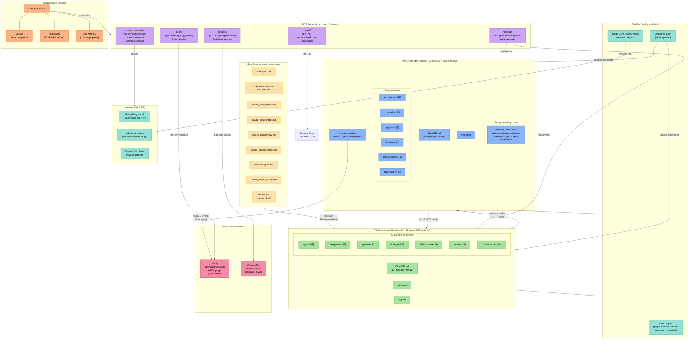

# Infrastructure Diagram

Mermaid diagram illustrating the project's full infrastructure, data flow, and dependencies.

## Diagram

## Key Architecture Summary

| Layer | Component | Role |
|-------|-----------|------|
| **Knowledge** | `raw/` (9 docs) → `wiki/` (60 pages) | Immutable sources ingested into LLM-maintained wiki |
| **Implementation** | `dev_graph/` (17 nodes) | Ontology-governed coding substrate with 17-type system |
| **Semantic Index** | `.smart-env/` (101 vectors) | Block-level embeddings via TaylorAI/bge-micro-v2 |
| **Graph DB** | Neo4j (via `sync_to_neo4j.py`) | 8 relationship types, APOC plugin, Graph-RAG queries |
| **Relational DB** | PostgreSQL (`layer_3_wiki`) | Structured data storage |
| **MCP Integration** | 5 servers | mcpvault, smart-connections, context7, neo4j, postgres |
| **Orchestration** | Claude Code + Serena | 42-permission allowlist, auto-memory, code navigation |

## Critical Constraint

Dev graph sessions are forbidden from modifying `wiki/` or `raw/` — enforced by the [[No Wiki Mutation]] constraint node.

## Relationships

### Depends On
- [[dev_graph/CLAUDE.md]] — governance rules that define the ontology shown here
- [[wiki/CLAUDE.md]] — wiki governance referenced in the diagram

### Provides
- Visual overview of all infrastructure components and data flow
- Quick reference for onboarding new sessions

### Constrained By
- [[No Wiki Mutation]] — the boundary shown between dev_graph and wiki
- [[Canonical Ownership]] — one node per concept
- [[Frontmatter Required]] — all content nodes need frontmatter

### Used By
- [[Dev Graph Dashboard]] — links to this for architectural context
- [[Context Pack Template]] — references infrastructure layout
