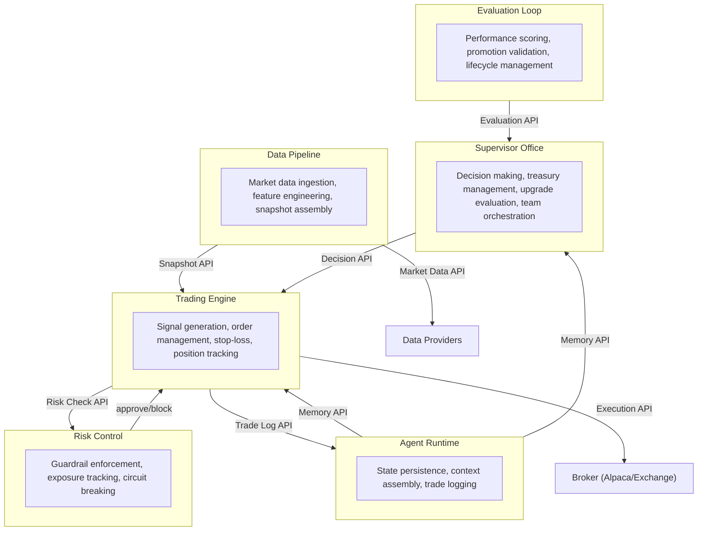

# Context Map

## Definition

Formal bounded context diagram defining the 6 systems of the autonomous trading engine and the relationships between them. This is the root structural artifact of the dev_graph — every engineering session can start here to understand where code fits.

## Purpose

Provides immediate structural context for any engineering task. Answers: "Which system does this module belong to? What systems does it communicate with? What are the boundary contracts?"

## Architecture Role

Root architecture node. All system nodes reference this map. All cross-system interfaces are visible here.

## Bounded Contexts

## System Boundaries

| System | Bounded Context | Upstream | Downstream |
|--------|----------------|----------|------------|
| Data Pipeline | Market data ingestion through snapshot assembly | External data providers | Trading Engine (via Snapshot API) |
| Trading Engine | Signal generation through order execution | Data Pipeline, Risk Control, Supervisor Office | Broker APIs, Agent Runtime |
| Risk Control | Guardrail enforcement and exposure tracking | Trading Engine (validation requests) | Trading Engine (approve/block decisions) |
| Agent Runtime | State persistence, context assembly, trade logging | All systems (memory consumers) | All systems (memory providers) |
| Evaluation Loop | Performance scoring and promotion validation | Agent Runtime (trade data) | Supervisor Office (evaluation results) |
| Supervisor Office | Decision making, treasury, upgrades, orchestration | Evaluation Loop, Agent Runtime | Trading Engine (upgrade decisions) |

## Cross-System Interfaces

8 primary interfaces defined at system boundaries (see Phase 4 for formal interface nodes):
1. Snapshot API — Data Pipeline → Trading Engine
2. Execution API — Trading Engine → Broker
3. Risk Check API — Risk Control ↔ Trading Engine
4. Memory API — Agent Runtime ↔ all systems
5. Trade Log API — Agent Runtime ← all systems
6. Decision API — Supervisor Office → Trading Engine
7. Evaluation API — Evaluation Loop → Supervisor Office
8. Treasury API — Supervisor Office internal

## Constraints

- System boundaries are decided once and defended — changing a boundary requires an ADR
- Each system owns its capabilities exclusively — no capability spans two systems
- Cross-system communication MUST use defined interfaces

## Relationships

### Contains
- (Forward references to Phase 2 system nodes)

### Depends On

### Provides
- Root structural context for all engineering sessions

### Validated By

### Constrained By
- [[No Wiki Mutation]]
- [[Canonical Ownership]]

### Used By
- All system nodes
- All capability nodes
- All context packs

### Originates From
