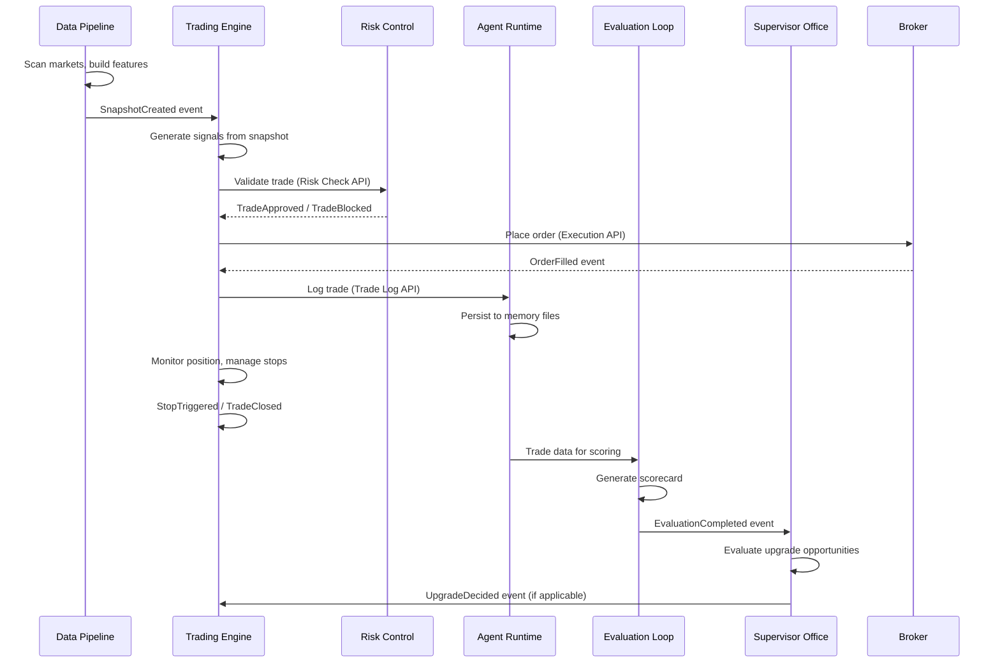

# Runtime Topology

## Definition

Component interaction model showing how the 6 systems communicate at runtime through events, interfaces, and data flows. While the Context Map shows static boundaries, the Runtime Topology shows dynamic behavior.

## Purpose

Answers runtime questions: "What happens when a signal is generated? Which events fire? Which systems are notified? What data flows where?"

## Architecture Role

Second architecture artifact. Complements the Context Map (static structure) with dynamic behavior. Used for debugging, incident analysis, and event-driven architecture planning.

## Runtime Data Flow

## Event Flow Summary

| Event | Emitter | Consumer(s) | Payload |
|-------|---------|-------------|---------|
| SnapshotCreated | Data Pipeline | Trading Engine | Snapshot data (L2) |
| SignalGenerated | Trading Engine | Risk Control | Signal + metadata |
| TradeApproved | Risk Control | Trading Engine | Approval + conditions |
| TradeBlocked | Risk Control | Trading Engine | Rejection reason |
| OrderPlaced | Trading Engine | Agent Runtime | Order details |
| OrderFilled | Broker | Trading Engine | Fill details |
| StopTriggered | Trading Engine | Agent Runtime | Stop details |
| TradeClosed | Trading Engine | Agent Runtime, Evaluation Loop | Trade result |
| TradeLogged | Agent Runtime | Evaluation Loop | Log entry |
| EvaluationCompleted | Evaluation Loop | Supervisor Office | Scorecard |
| PromotionDecided | Evaluation Loop | Supervisor Office | Promotion result |
| UpgradeDecided | Supervisor Office | Trading Engine | Upgrade specification |

## Runtime Scheduling

| Routine | Timing | Systems Involved |
|---------|--------|-----------------|
| Pre-market scan | 6:00 AM | Data Pipeline |
| Market open trading | 9:30 AM | Trading Engine, Risk Control |
| Midday management | 12:00 PM | Trading Engine (stop management) |
| Market close review | 4:00 PM | Agent Runtime, Evaluation Loop |
| Weekly review | Weekend | Evaluation Loop, Supervisor Office |

## Implementation Notes

Event nodes are created in Phase 7 when event-driven architecture is implemented in code. This topology defines the TARGET runtime behavior.

## Relationships

### Depends On
- [[Context Map]]

### Provides
- Runtime behavior model for debugging and design

### Contains

### Constrained By

### Used By
- Event nodes (Phase 7)
- Workflow nodes (Phase 6)

### Originates From
