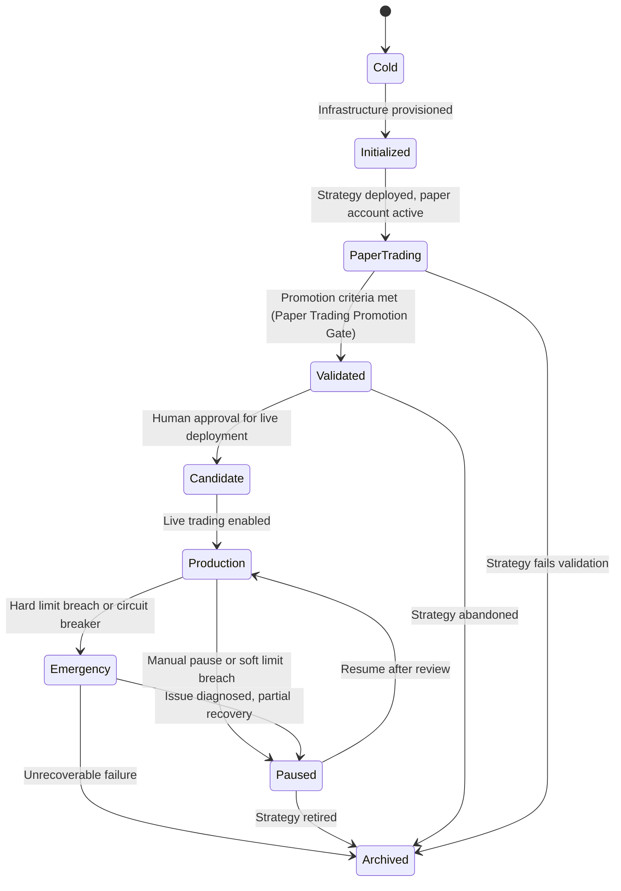

# System Lifecycle

## Definition

The canonical state machine governing the operational lifecycle of the autonomous trading system. Defines the states a trading system instance can be in, the transitions between them, and the conditions (guards) that must be satisfied for each transition.

## Purpose

Provides deterministic lifecycle management. Answers: "What state is the system in? What must happen before it can advance? Under what conditions should it retreat to a safer state?"

## Architecture Role

Cross-cutting workflow owned by the [[Evaluation Loop]] system but affecting all systems. The lifecycle state determines which capabilities are active (e.g., live order execution is only enabled in Production state).

## State Machine

## State Definitions

| State | Description | Active Capabilities |
|-------|-------------|-------------------|
| Cold | No infrastructure. System exists only as ontology nodes. | None |
| Initialized | Infrastructure provisioned. API keys configured. Code deployed. | Data Pipeline only |
| PaperTrading | Strategy running against paper trading account. Generating evidence. | All except live execution |
| Validated | Paper trading evidence meets promotion criteria. Awaiting human approval. | All except live execution |
| Candidate | Approved for live trading. Monitoring period active. | All — live execution enabled with enhanced monitoring |
| Production | Fully autonomous live trading. Normal monitoring cadence. | All |
| Paused | Temporarily halted. Positions held but no new trades. | Data Pipeline, Agent Runtime, Evaluation Loop |
| Emergency | Hard limit breach or system failure. All trading halted. | Agent Runtime (logging only) |
| Archived | Strategy retired. System preserved for audit trail. | None (read-only) |

## Transition Guards

| Transition | Guard Condition |
|-----------|----------------|
| Cold → Initialized | API credentials configured, code deployed, CLAUDE.md written |
| Initialized → PaperTrading | Paper trading account active, strategy file defined |
| PaperTrading → Validated | Paper Trading Promotion Gate passes: >=3 metrics improved, no regressions, >=12% average improvement |
| Validated → Candidate | Human approval (explicit sign-off) |
| Candidate → Production | Monitoring period completed without incidents |
| Production → Paused | Manual trigger OR soft limit breach (e.g., daily loss approaching cap) |
| Paused → Production | Human review confirms safe to resume |
| Production → Emergency | Hard limit breach OR circuit breaker triggered |
| Emergency → Paused | Root cause identified, partial mitigation applied |
| Any → Archived | Strategy retirement decision (manual) |

## Relationships

### Depends On

### Provides
- Lifecycle governance for all system operations

### Contains

### Guards
- (Forward references: Paper Trading Promotion Gate — Phase 6)

### Constrained By

### Used By
- [[Evaluation Loop]]
- [[Supervisor Office]]
- All system nodes (lifecycle state determines active capabilities)

### Originates From
- [[Paper Trading Validation]]
- [[Guardrail Philosophy]]
- [[Agent Safety Principles]]
