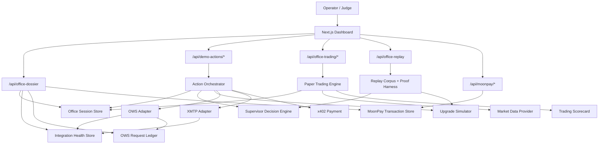
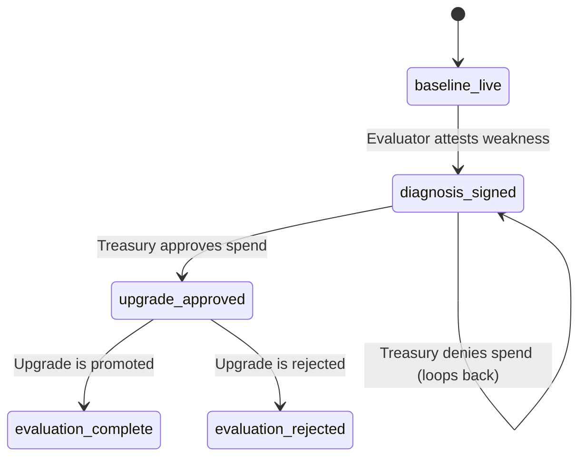
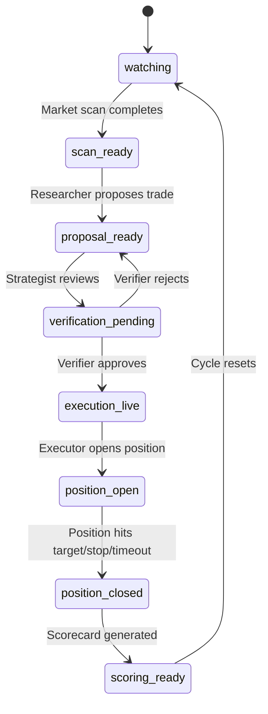

# Architecture

## One Sentence

The Syndicate Squad is a wallet-native supervisor system that assembles an agent team, evaluates weaknesses, allocates treasury under policy, applies upgrades, and records whether those upgrades actually improved the office.

## System Diagram

## Core Idea

The product is not a single worker agent.

The product is the **supervisor**:

- watches the office
- identifies a weak desk
- chooses an upgrade from a catalog
- spends treasury under policy
- evaluates whether the upgrade helped
- records the result in institutional memory

That makes the system closer to an institution than a prompt chain.

## Main Components

### 1. Dashboard

Files:

- `components/OpsConsole.tsx`
- `components/OpsWidgets.tsx`
- `components/OfficeDashboard.tsx`

Responsibilities:

- render the office state
- trigger the office action loop and paper trading workflow
- show treasury, versions, metrics, memory, and audit history
- surface integration readiness and latest action status
- manage MoonPay on/off-ramp flows

The dashboard is a view over the server dossier, not the source of truth.

### 2. Domain Model

Files:

- `lib/domain.ts`

Responsibilities:

- define office-native types
- keep every layer on the same vocabulary

Core office types:

- `MissionRecord` -- office mission with round and version tracking
- `AgentIdentity` -- desk, budget, versionTag, wallet, XMTP identity
- `TreasuryPolicyView` -- budget, deployed, available, spend limit
- `TreasuryRequest` -- policy-gated spend requests with cost and sign request details
- `UpgradeOption` -- upgrade catalog entry with cost and target desk
- `InterventionRecord` -- upgrade decisions with cost and outcome
- `TeamVersion` -- versioned team snapshots with status
- `InstitutionMemoryEntry` -- cross-round learning records
- `PerformanceMetric` -- v1 vs v2 comparison with direction and tone

Infrastructure types:

- `WalletDescriptor` -- wallet with chain accounts
- `AccountDescriptor` -- chain account details
- `ApiKey` -- API key with wallet/policy bindings
- `PolicyDescriptor` -- policy with deny/warn action
- `XmtpIdentity` -- inbox ID and consent state

Paper trading types:

- `WatchlistSymbol`, `MarketSnapshot`, `MarketScanRecord` -- market data
- `TradeIdea`, `VerificationDecision` -- trade proposals and review
- `PaperPosition`, `PositionEvent` -- position lifecycle
- `EvaluationWindow`, `EvaluationScorecard` -- scoring and promotion
- `UpgradeExperiment` -- tracks an upgrade through its trading lifecycle
- `PaperTradingLoopState` -- aggregate state for the entire trading loop
- `WorkCycleStage` -- 8-stage cycle from watching to scoring

Flow control types:

- `DemoStep` -- 6 states in the office action loop
- `DemoScenario` -- top-level composite wiring everything together

### 3. Scenario Layer

Files:

- `lib/demo-scenario.ts`
- `lib/office-view-model.ts`

Responsibilities:

- derive office state for each step
- turn engine results into a legible product story
- surface promoted and rejected paths
- expose multi-round evolution in the real UI state

This layer is where the deterministic autonomy engine becomes a demo judges can actually understand.

### 4. Action Orchestrator

Files:

- `lib/demo-actions.ts`
- `lib/office-runtime.ts`
- `lib/demo-bootstrap.ts`
- `lib/integrations/types.ts`

Responsibilities:

- execute the three office server actions: sign-review, grant-authority, verify-task
- coordinate OWS signing, XMTP messaging, and x402 payment for each action
- resolve the demo scenario per step and look up agents/requests by name
- determine action mode (live, demo, hybrid) based on integration readiness
- generate audit events and message envelopes per action
- reset and bootstrap the demo state

`demo-actions.ts` is the largest single file in the repo (~770 lines). Each action function:

1. reads the current session and scenario
2. checks integration readiness (OWS, XMTP, x402)
3. attempts live calls with fallback to demo mode
4. assembles the result with `nextStep`, OWS/XMTP/x402 status, audit events, and messages
5. hands the result to the session store for persistence

### 5. Supervisor Decision Engine

Files:

- `lib/supervisor-decision.ts`

Responsibilities:

- score upgrade options against current office weaknesses
- respect treasury spend limits and available budget
- skip failed upgrades that memory has blacklisted
- incorporate evidence from paper trading scorecards when available

Inputs:

- current metrics
- upgrade catalog
- treasury state
- excluded upgrade ids
- optional: evaluation scorecards from the paper trading loop

Outputs:

- selected upgrade id and label
- ranked options with scores, allowed/blocked status, and reasons
- rationale string

The scoring function weights weakness severity (disagreement, confidence, convergence, cost, PnL capture) per upgrade. When scorecard evidence is available, it adjusts scores based on realized PnL, drawdown, latency, disagreement percentage, and calibration.

Early exit: if the latest scorecard already shows a promotable result (positive PnL, calibration >= 65%), the engine returns no upgrade needed.

### 6. Upgrade Simulator

Files:

- `lib/office-simulator.ts`

Responsibilities:

- simulate the effect of each upgrade on office metrics
- compute improvement count, regression count, and average improvement
- decide whether a result earns promotion

Promotion logic is deterministic:

- at least 3 metrics improved
- no regressions
- average relative improvement at or above 12%

The simulator accepts an optional `factor` parameter (default 1) that scales all deltas, used by the replay harness for scenario variation.

### 7. Multi-Round Evolution Engine

Files:

- `lib/office-evolution.ts`

Responsibilities:

- run repeated supervisor rounds
- carry promoted metrics forward
- burn treasury across rounds
- skip known bad upgrades after rejection
- accumulate institutional memory entries across rounds

Important: treasury is burned on every upgrade attempt, not just successful ones. If the supervisor selects an upgrade and it gets rejected, the cost is still deducted. This is by design -- you pay for failed experiments.

When no valid upgrade can be found (budget exhausted, all options excluded), the round is recorded as a no-op: no treasury burn, no metric change.

### 8. Paper Trading Engine

Files:

- `lib/trading-workflow.ts` -- propose, verify, execute, close trades
- `lib/trading-scorecard.ts` -- evaluation scoring with PnL, win rate, drawdown, calibration
- `lib/paper-trading-loop.ts` -- state normalization and defaults for the 8-stage work cycle
- `lib/market-data.ts` -- market data provider with demo scanner and pluggable live adapters (Allium, Uniblock, Zerion)
- `lib/market-scanner.ts` -- scan orchestration, writes results to session

Responsibilities:

- run a full paper trading cycle: scan -> propose -> verify -> execute -> close -> score
- each step is gated by the current `WorkCycleStage`
- generate scorecards that feed back into the supervisor decision engine
- provide evidence for whether an upgrade actually improved trading performance

The paper trading loop is the evaluation layer that connects the supervisor's upgrade decision to measurable outcomes. Without it, the supervisor can only simulate improvements -- with it, the office can generate real (paper) trading evidence before promoting.

### 9. Replay Proof Harness

Files:

- `lib/office-replay.ts`
- `lib/office-replay-proof.ts`
- `app/api/office-replay/route.ts`
- `scripts/report-office-replays.ts`

Responsibilities:

- run the supervisor across a large deterministic corpus
- prove the office does not always pick the same upgrade
- prove the supervisor can recover after failed interventions
- prove stop conditions like marginal return and budget guard

This is the strongest anti-theater layer in the repo.

### 10. Session / Persistence Layer

Files:

- `lib/office-session-store.ts`
- `lib/office-session.ts`
- `lib/office-dossier.ts`

Responsibilities:

- persist the current office session (step, actions, paper trading state)
- persist action telemetry (JSONL append log)
- persist OWS request ledger
- persist archived runs (via separate history store)
- aggregate the server dossier used by the UI

The dossier (`/api/office-dossier`) aggregates: session snapshot, action log, OWS requests, integration health, and MoonPay snapshot. Archived run history is served separately by `/api/office-history`.

### 11. Integration Adapters

Files:

- `lib/integrations/ows.ts` -- OWS REST/proxy adapter
- `lib/integrations/xmtp.ts` -- XMTP messaging adapter
- `lib/integrations/status.ts` -- combined integration status view
- `lib/integrations/health-store.ts` -- health snapshot persistence
- `lib/integrations/types.ts` -- shared result types (`ActionOwsStatus`, `ActionXmtpStatus`, etc.)

Responsibilities:

- provide live-or-fallback OWS request handling
- provide live-or-fallback XMTP messaging
- record integration readiness and recent failures
- keep the product safe in demo mode when credentials are missing

### 12. x402 Payment Integration

Files:

- `lib/x402.ts`
- `app/api/x402/purchase-upgrade/route.ts`

Responsibilities:

- handle pay-per-call upgrade purchases via USDC on Base Sepolia
- server side: @x402/core v2 server that gates the purchase endpoint behind a payment header
- client side: shells out to OWS CLI (`ows pay request`) for wallet-backed signing
- extract settlement tx hash from payment response headers, with Blockscout API fallback
- follow the same live-or-fallback pattern as OWS and XMTP adapters

### 13. MoonPay Integration

Files:

- `lib/moonpay.ts` -- ramp URL builder, HMAC-SHA256 signing, webhook verification
- `lib/moonpay-store.ts` -- transaction persistence with atomic writes
- `app/api/moonpay/ramp-url/route.ts` -- generates signed widget URLs
- `app/api/moonpay/return/route.ts` -- records redirect returns
- `app/api/moonpay/webhook/route.ts` -- HMAC-verified webhook handler
- `app/moonpay/return/page.tsx` -- return landing page

Responsibilities:

- fiat on-ramp and off-ramp for treasury funding
- cryptographic URL signing with MoonPay secret key
- webhook signature verification using HMAC-SHA256 with timing-safe comparison
- transaction lifecycle tracking (initiated -> pending -> completed/failed)

## Office Action Loop

Note: the `upgrade_denied` step exists in the type system as a terminal state but is not reached through normal action flow. The denial branch loops back to `diagnosis_signed`, allowing the supervisor to revise and resubmit.

## Paper Trading Work Cycle

## Data Flow

### Demo Loop

1. Client hits `/api/demo-bootstrap` or `/api/office-session`
2. Server returns the current dossier
3. User triggers one of the office actions
4. Action orchestrator executes office logic and optional live adapters
5. Session store persists the new step and action record
6. Dossier rehydrates the full office state
7. UI redraws from server truth

### Paper Trading Loop

1. Client triggers `/api/office-market-scan` to seed the watchlist
2. `/api/office-trading/propose` generates a trade idea from market data
3. `/api/office-trading/verify` reviews and approves/rejects the idea
4. `/api/office-trading/execute` opens a paper position
5. `/api/office-trading/close` closes the position with an outcome
6. `/api/office-trading/score` generates an evaluation scorecard
7. Scorecard feeds back into the supervisor decision engine as evidence

### Replay Proof

1. Client or script requests `/api/office-replay`
2. Server builds a deterministic replay corpus
3. Replay engine runs supervisor decisions over many scenarios
4. Server returns summary stats plus a recovery example
5. UI or submission materials use that as proof that the supervisor is not just acting out a script

## OWS Integration

OWS is used as the authority layer, not as decoration.

Modeled concepts:

- wallet descriptors
- account descriptors
- API keys
- policy descriptors
- sign requests

There are two separate OWS touchpoints in this repo:

1. OWS REST/proxy adapter
- powers readiness, health, ledger, and the diagnosis signing slice
- remains live-or-fallback depending on `OWS_AGENT_BASE_URL` and `OWS_API_KEY`

2. OWS local wallet CLI
- powers the live x402 upgrade purchase signing path through `ows pay request`
- removes the raw x402 buyer private key from env/code

Current live slices:

- x402 upgrade purchases are signed by a local OWS wallet
- diagnosis attestation is the first live-capable OWS REST/proxy action

Current product role:

- treasury authority is policy-shaped
- wallet identity is visible per desk
- OWS request tracking and health are persisted

Important note:

The app is integration-ready with graceful fallbacks.
Only the diagnosis path is wired for live OWS REST/proxy access today.

## XMTP Integration

XMTP is the structured messaging rail between desks.

Current role:

- live-or-fallback desk messaging
- readiness checks
- target-aware send behavior
- health tracking

Important note:

XMTP live send depends on local native bindings and valid signer env.
The product degrades safely if live send is unavailable.

## x402 Integration

x402 is the pay-per-call protocol for upgrade purchases.

Current role:

- USDC micropayments on Base Sepolia via OWS wallet
- @x402/core v2 server gates the purchase endpoint
- Coinbase-hosted facilitator handles settlement
- tx hash extracted from payment response headers, Blockscout API fallback

Important note:

`ows pay request` does not expose the `PAYMENT-RESPONSE` header directly.
The tx hash lookup via Blockscout is best-effort attribution.

## MoonPay Integration

MoonPay provides fiat on-ramp and off-ramp for treasury funding.

Current role:

- sandbox environment for demo
- HMAC-SHA256 signed widget URLs
- webhook verification with timing-safe comparison
- transaction lifecycle tracking

Important note:

MoonPay is not referenced in the demo action loop. It provides a parallel funding path for the treasury that operates independently of the supervisor's upgrade decisions.

## What Is Real vs Simulated

### Real

- server-side office state
- persisted session/action/history stores
- supervisor decision engine with evidence-based scoring
- upgrade simulator
- multi-round evolution engine
- deterministic replay corpus
- paper trading engine with full propose/verify/execute/close/score cycle
- OWS readiness / ledger / health
- XMTP readiness / health
- MoonPay webhook verification and transaction tracking
- API contracts
- full regression suite

### Simulated

- upgrade outcomes (deterministic deltas, not live performance)
- long-horizon office learning
- treasury spend effects
- office metrics
- market data (demo provider with seeded prices)

### Live-Or-Fallback

- OWS diagnosis REST/proxy path
- OWS wallet-backed x402 purchase path
- XMTP sends
- MoonPay on/off-ramp (sandbox)

## Proof Surface

The project is strongest where it proves supervisor behavior instead of just narrating it.

Current proof surfaces:

- `npm run test`
- `npm run build`
- `npm run smoke:office`
- `npm run report:replay`
- `/api/office-replay`

These prove:

- multiple upgrade paths are used
- failed upgrades can be rejected
- the supervisor can recover
- treasury can stop further spend
- marginal-return stop conditions exist
- the x402 upgrade purchase route returns real `402 Payment Required` responses when unpaid
- the x402 upgrade purchase path can settle live on Base Sepolia through an OWS wallet and return a public tx hash

## Current Gaps

- OWS REST/proxy live success is still limited to the first diagnosis slice
- x402 receipt attribution in the OWS wallet path is still best-effort because `ows pay request` does not expose settlement headers
- XMTP live send depends on local machine state
- browser-level polish still needs a judge-facing pass
- paper trading loop uses demo market data, not live feeds
- MoonPay is sandbox-only

## Why This Architecture Matters

Without the decision engine, evolution engine, replay harness, paper trading loop, and persistent dossier, this would collapse into a UI script.

With those layers, the product actually demonstrates the thesis:

**the supervisor is trying to improve the office, not just pretending to.**