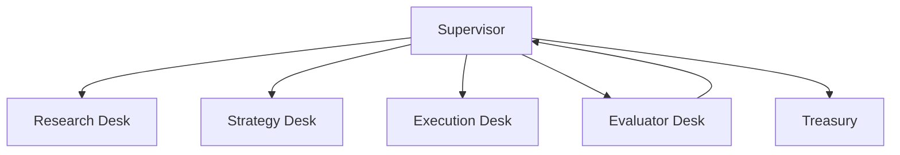
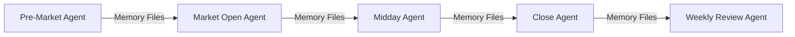

# Multi-Agent Orchestration

## Definition

The coordination of multiple specialized AI agents working together toward a shared objective. Encompasses subagent delegation, information flow between agents, and supervisory control patterns.

## Purpose

Enables complex trading workflows that benefit from specialization: research agents, strategy agents, execution agents, evaluation agents. Each agent focuses on its domain while orchestration ensures coherent system behavior.

## Architecture Role

Coordination pattern used across [[Syndicate Squad Architecture]] (formal multi-agent) and [[Claude Routines]] (implicit multi-agent via sequential routines).

## Orchestration Patterns

### Pattern 1: Supervisor-Worker (Syndicate Squad)

The supervisor assembles teams, evaluates performance, spends treasury on upgrades, and records results. Workers (desks) are specialized agents.

Source: [[SRC - OWS Dev Squad]]

### Pattern 2: Sequential Routines (Implicit Multi-Agent)

Each routine invocation is effectively a different "agent" that reads and writes to shared memory files. Coordination is implicit through file-based state.

Source: [[SRC - Claude Opus Trader]]

### Pattern 3: Delegated Subagents

"Spin up a team of sub agents. You're my wealth adviser. Try to beat the S&P. Figure out the best plan possible."

The primary agent delegates research and analysis to subagents, then aggregates their findings.

Source: [[SRC - Claude Opus Trader]]

## Agent Roles (Syndicate Squad)

| Desk | Role | Domain |
|------|------|--------|
| Research | Market scanning, catalyst identification | Data |
| Strategy | Signal generation, trade proposals | Analysis |
| Execution | Order placement, position management | Trading |
| Evaluator | Performance scoring, weakness identification | Quality |
| Supervisor | Resource allocation, upgrade decisions | Coordination |

## Coordination Mechanisms

| Mechanism | Description | Used In |
|-----------|-------------|---------|
| Memory files | Shared state via filesystem | Routines pattern |
| Institutional memory | Cross-round learning records | Syndicate Squad |
| XMTP messaging | Structured inter-desk communication | Syndicate Squad |
| Git repository | Shared persistent state | Remote routines |

## Inputs

- Agent definitions and roles
- Coordination protocol
- Shared state (memory files or database)

## Outputs

- Coordinated system behavior
- Audit trail of agent interactions
- Performance metrics per agent

## Dependencies

- [[Agent Memory Architecture]] — shared state
- [[Claude Code]] or [[Claude Routines]] — runtime
- [[Supervisor Decision Engine]] — coordination logic (Syndicate Squad)

## Failure Modes

- Agents with conflicting objectives → incoherent behavior
- State corruption from concurrent access
- Communication failure between agents
- Cascading failures from one agent's error
- Sub-optimal resource allocation

## Tradeoffs

| Decision | Tradeoff |
|----------|----------|
| Explicit supervisor vs. implicit coordination | More control vs. simpler architecture |
| Specialized agents vs. generalist | Better per-domain performance vs. coordination overhead |
| Synchronous vs. async orchestration | Predictable vs. scalable |

## Related Concepts

- [[Supervisor Decision Engine]]
- [[Syndicate Squad Architecture]]
- [[Agent Memory Architecture]]
- [[Stateless Agent Recovery]]
- [[Claude Routines]]

## Open Questions

- Optimal agent specialization granularity?
- Conflict resolution between agents with competing recommendations?
- How to scale multi-agent systems while maintaining coherence?

## Future Extensions

- Reinforcement learning for agent team composition
- Dynamic agent spawning based on market conditions
- Cross-agent skill transfer
- Hierarchical multi-supervisor architectures

## Source References

- Source: [[SRC - OWS Dev Squad]] — Syndicate Squad supervisor-worker architecture
- Source: [[SRC - Claude Opus Trader]] — subagent delegation, sequential routine orchestration
