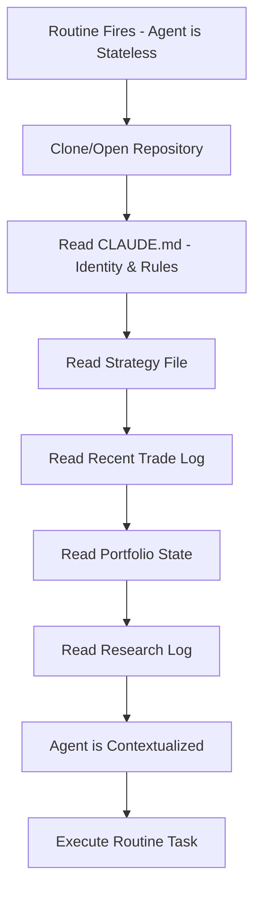

# Stateless Agent Recovery

## Definition

The pattern by which a stateless agent invocation reconstructs its operational context from persistent files at the start of each routine execution. The fundamental mechanism enabling disciplined autonomous behavior from ephemeral LLM sessions.

## Purpose

Bridges the gap between the LLM's lack of built-in memory and the requirement for consistent, disciplined trading behavior across days and weeks.

## Architecture Role

Recovery mechanism in [[Agent Memory Architecture]]. Executed at the start of every [[Claude Routines]] invocation.

## Recovery Protocol

## Key Insight

> "Every time a routine fires at 7 a.m., Claude Code basically wakes up essentially stateless. It doesn't really know anything. So how do you make a stateless agent act disciplined and remember rules and learn over time? You do that with files and with context."

Source: [[SRC - Claude Opus Trader]]

## Recovery Files (Priority Order)

1. **CLAUDE.md** — Agent identity, name, role, guardrails (ALWAYS read first)
2. **strategy.md** — Trading strategy rules and parameters
3. **trade-log.md** — Recent trade history (windowed for context budget)
4. **portfolio-state.md** — Current positions and equity
5. **research-log.md** — Recent research findings
6. **weekly-review.md** — Latest performance evaluation

## Inputs

- Git repository (cloned for remote routines)
- Local file system (for local routines)
- Routine-specific prompt (defines task scope)

## Outputs

- Fully contextualized agent ready for task execution

## Dependencies

- [[Agent Memory Architecture]] — defines what to read
- [[Context Budget Engineering]] — constrains how much to read
- [[Claude Routines]] — triggers the recovery

## Failure Modes

- **Missing files**: Critical memory file deleted or corrupted → agent operates blind
- **Stale files**: Git push failed on previous routine → agent reads old state
- **Context overflow**: Too many files → reasoning quality degrades
- **Wrong file order**: Reading low-priority files before critical ones wastes budget

## Related Concepts

- [[Agent Memory Architecture]]
- [[Context Budget Engineering]]
- [[Claude Routines]]
- [[LLM Failure Modes in Trading]]

## Source References

- Source: [[SRC - Claude Opus Trader]] — stateless wake, file-based recovery, memory as personality
