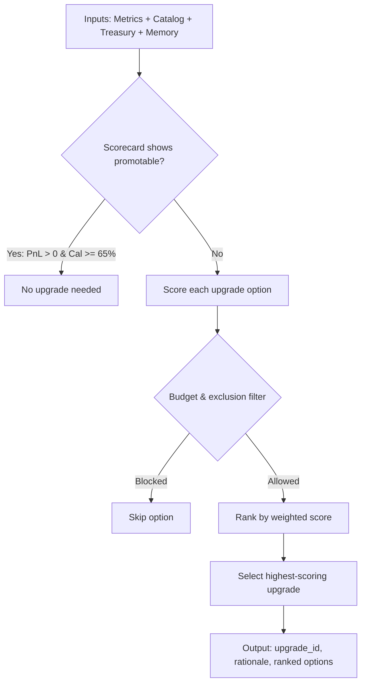

# Supervisor Decision Engine

## Definition

The algorithmic core of the Syndicate Squad that scores upgrade options against current office weaknesses, respects treasury constraints, incorporates paper trading evidence, and selects the optimal upgrade to apply. The supervisor IS the product — not the individual agents.

## Purpose

Makes autonomous resource allocation decisions: which agent/desk to upgrade, how much treasury to spend, and whether the upgrade actually helped. Implements institutional judgment.

## Architecture Role

Central decision-making component in [[Syndicate Squad Architecture]]. Drives the [[Office Action Loop]] and consumes evidence from [[Paper Trading]].

## Decision Algorithm

### Scoring Function

Weights weakness severity across dimensions:
- **Disagreement** between agents
- **Confidence** levels
- **Convergence** metrics
- **Cost** efficiency
- **PnL capture** performance

When scorecard evidence is available, adjusts scores based on:
- Realized PnL
- Drawdown
- Latency
- Disagreement percentage
- Calibration

### Early Exit

If the latest scorecard shows a promotable result:
- Positive PnL
- Calibration >= 65%

→ Returns "no upgrade needed." The office is already performing well enough.

Source: [[SRC - OWS Dev Squad]]

## Inputs

- Current performance metrics
- Upgrade catalog (options with costs)
- Treasury state (budget, deployed, available, spend limit)
- Excluded upgrade IDs (from institutional memory — previously failed)
- Optional: evaluation scorecards from [[Paper Trading]] loop

## Outputs

- Selected upgrade ID and label
- Ranked options with scores, allowed/blocked status, and reasons
- Rationale string

## Treasury Mechanics

- Treasury is burned on EVERY upgrade attempt, not just successful ones
- Failed experiments still cost money — "you pay for failed experiments"
- When budget exhausted or all options excluded → round recorded as no-op

Source: [[SRC - OWS Dev Squad]]

## Multi-Round Evolution

The supervisor runs repeated rounds:
1. Evaluate current state
2. Select upgrade (or determine none needed)
3. Apply upgrade (simulate or paper trade)
4. Evaluate result → promote or reject
5. Carry promoted metrics forward
6. Skip known-bad upgrades in future rounds
7. Accumulate institutional memory

Source: [[SRC - OWS Dev Squad]] — `lib/office-evolution.ts`

## Dependencies

- [[Office Action Loop]] — execution flow
- [[Paper Trading]] — evidence generation
- [[Syndicate Squad Architecture]] — system context
- [[Treasury Policy System]] — budget constraints

## Failure Modes

- All upgrade options exhausted → system stagnates
- Budget depleted on failed upgrades → no resources for improvement
- Institutional memory incorrectly excludes valid upgrades
- Scorecard evidence from insufficient paper trading sample

## Tradeoffs

| Decision | Tradeoff |
|----------|----------|
| Burn treasury on failed upgrades | Realistic resource accounting vs. faster budget depletion |
| Early exit on promotable scorecard | Avoids unnecessary spending vs. may miss better upgrades |
| Excluding failed upgrades | Prevents repeating mistakes vs. regime changes may make old upgrades valid |

## Related Concepts

- [[Syndicate Squad Architecture]]
- [[Office Action Loop]]
- [[Treasury Policy System]]
- [[Multi-Agent Orchestration]]
- [[Paper Trading]]
- [[Agent Self-Verification]]

## Source References

- Source: [[SRC - OWS Dev Squad]] — complete decision engine specification, scoring function, treasury mechanics
