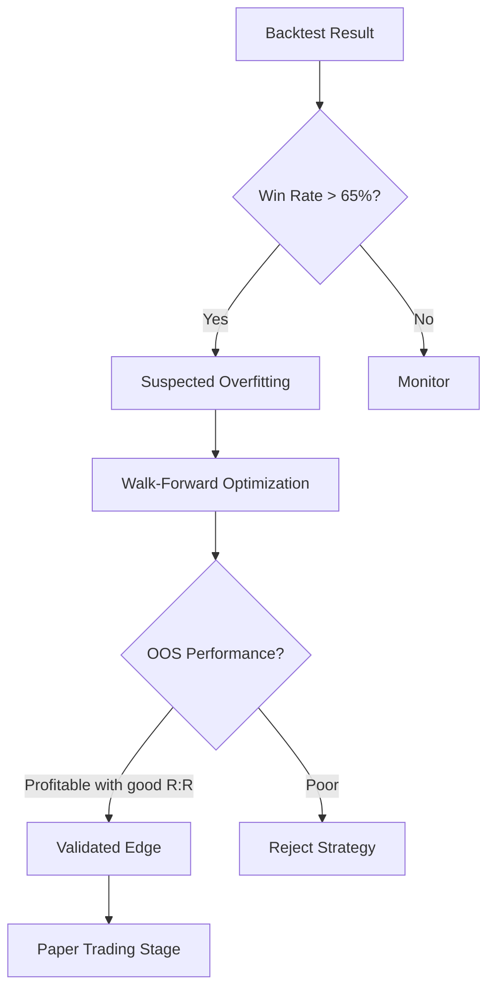

# Overfitting Detection

## Definition

Techniques for identifying when a trading strategy has memorized historical patterns rather than learning generalizable rules. Overfitted strategies show excellent backtest performance that collapses in live trading.

## Purpose

Prevents deployment of strategies that appear profitable in backtests but will lose money in production. Critical quality gate before [[Paper Trading]] promotion.

## Architecture Role

Validation constraint in [[Trading Engine Pipeline]] refinement loop. Triggers [[Walk-Forward Optimization]] when detected.

## Detection Signals

| Signal | Threshold | Interpretation |
|--------|-----------|---------------|
| Win rate > 65% in backtest | > 65% | "That's a number that immediately makes you suspicious" |
| Large performance gap IS vs OOS | > 20% drop | Strategy memorized training data |
| Many optimized parameters | > 5 free params | More degrees of freedom = more overfitting risk |
| Unstable parameters across windows | High variance | Strategy not robust to regime changes |

Source: [[SRC - Claude Stock Trader]] — "anything above 65% on a backtest usually means one thing: overfitting"

## Mitigation Pipeline



## Key Metrics After Validation

After removing overfitting via [[Walk-Forward Optimization]]:
- **Win rate**: Will likely drop (53% from 74% in example)
- **Risk-reward ratio**: Should remain favorable (1:2+ target)
- **Expected value**: Must be positive: `(WinRate × AvgWin) - (LossRate × AvgLoss) > 0`

With 53% win rate and 1:2.3 R:R:
```
EV = (0.53 × 2.3) - (0.47 × 1.0) = 1.219 - 0.47 = +0.749 per unit risk
```

## Inputs

- Backtest results (in-sample and out-of-sample)
- Strategy parameter count
- Parameter stability metrics

## Outputs

- Overfitting risk assessment
- Recommended validation steps
- Validated or rejected strategy verdict

## Dependencies

- [[Walk-Forward Optimization]]
- [[Backtesting Methodology]]

## Failure Modes

- **Premature validation**: Declaring strategy valid with insufficient out-of-sample data
- **Multiple testing problem**: Testing many strategies → some will appear profitable by chance
- **Data snooping**: Using out-of-sample data during development

## Related Concepts

- [[Walk-Forward Optimization]]
- [[Backtesting Methodology]]
- [[Signal Confirmation]]
- [[LLM Failure Modes in Trading]]
- [[Autonomous Trading Risk Model]]

## Source References

- Source: [[SRC - Claude Stock Trader]] — overfitting detection heuristic (>65% → suspect), validation results
