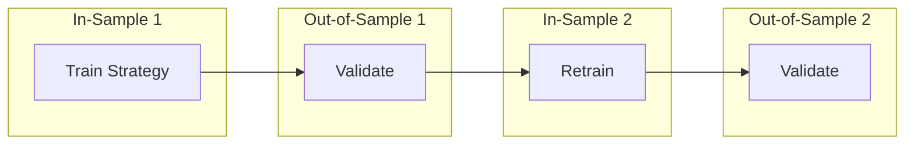

# Walk-Forward Optimization

## Definition

A validation methodology that splits historical data into sequential in-sample (training) and out-of-sample (testing) windows, then evaluates strategy performance on unseen data. The primary defense against [[Overfitting Detection|overfitting]].

## Purpose

Distinguishes genuine trading edges from curve-fitted artifacts. Ensures strategy parameters generalize beyond the data they were trained on.

## Architecture Role

Validation stage in [[Trading Engine Pipeline]] refinement loop. Required before any strategy is promoted from backtest to [[Paper Trading]] or live execution.

## Methodology

1. **Split**: Divide data into sequential in-sample and out-of-sample windows
2. **Train**: Optimize strategy parameters on in-sample data
3. **Test**: Evaluate on out-of-sample data WITHOUT modification
4. **Walk forward**: Slide the window and repeat
5. **Aggregate**: Report performance across all out-of-sample windows

## Key Evidence

Initial backtest: **74% win rate** → suspicious (anything >65% in quant trading suggests overfitting)

After walk-forward optimization: **53% win rate** with **1:2.3 risk-reward ratio** → "that math is extremely profitable and that's what an actual edge looks like"

The drop from 74% to 53% is the overfitting being removed. The 1:2.3 risk-reward means winners are 2.3x the size of losers — profitable despite sub-50% win rate at sufficient frequency.

Source: [[SRC - Claude Stock Trader]]

## Inputs

- Historical price/volume data (12+ months recommended)
- Strategy rules and parameters
- In-sample / out-of-sample split ratio

## Outputs

- Out-of-sample win rate
- Out-of-sample risk-reward ratio
- Parameter stability across windows
- Confidence assessment of strategy edge

## Dependencies

- Historical market data
- [[Backtesting Methodology]]
- [[Three-Layer Trading System]] (strategy engine)

## Failure Modes

- **Insufficient data**: Too short a history → results not statistically significant
- **Survivorship bias**: Only testing on stocks that still exist
- **Look-ahead bias**: Accidentally using future data in training
- **Transaction cost neglect**: Ignoring slippage and commissions

## Tradeoffs

| Decision | Tradeoff |
|----------|----------|
| Larger in-sample | Better parameter estimation but less out-of-sample data |
| More windows | Better statistical confidence but computationally expensive |
| Tight vs. loose parameters | Tight parameters overfit; loose parameters underperform |

## Related Concepts

- [[Overfitting Detection]]
- [[Backtesting Methodology]]
- [[Signal Confirmation]]
- [[Trading Engine Pipeline]]
- [[Autonomous Trading Risk Model]]

## Open Questions

- Optimal in-sample to out-of-sample ratio?
- How to handle regime changes within walk-forward windows?
- Automated walk-forward optimization in routine pipeline?

## Future Extensions

- Combinatorial purged cross-validation
- Regime-aware walk-forward windows
- Monte Carlo permutation tests for edge significance
- Automated parameter stability analysis

## Source References

- Source: [[SRC - Claude Stock Trader]] — walk-forward validation evidence (74% → 53%, 1:2.3 R:R)
