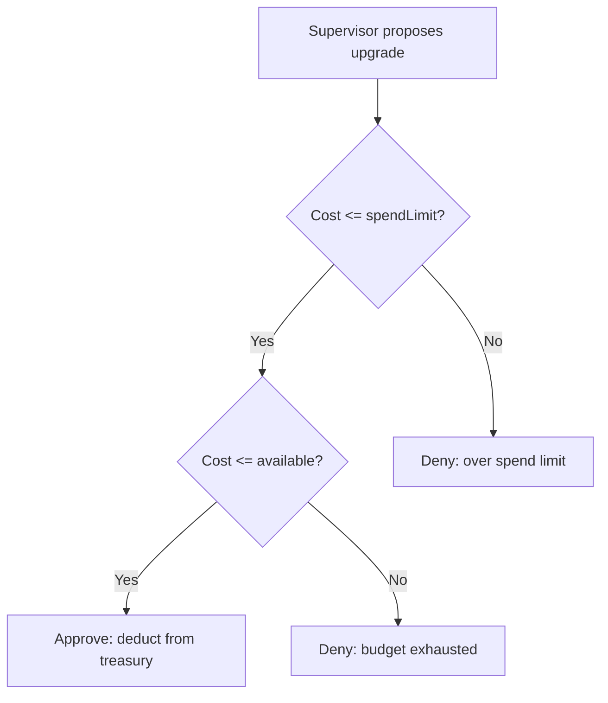

# Treasury Policy System

## Definition

The budget and policy framework governing resource allocation in the [[Syndicate Squad Architecture]]. Treasury constrains how much the supervisor can spend on agent upgrades and under what conditions.

## Purpose

Prevents unbounded spending. Ensures upgrade decisions are economically rational. Makes resource scarcity a design constraint, not an afterthought.

## Architecture Role

Constraint layer for [[Supervisor Decision Engine]]. Part of [[Syndicate Squad Architecture]] governance.

## Treasury Model

```
TreasuryPolicyView {
  budget: total allocated funds
  deployed: funds already spent on upgrades
  available: budget - deployed
  spendLimit: max per-upgrade spend
}
```

## Key Mechanics

- Treasury is burned on EVERY upgrade attempt, successful or not
- Failed experiments still cost money
- When budget exhausted → no more upgrades possible
- Spend limit caps individual upgrade cost
- Policy gates: approve or deny spend requests

## Policy-Gated Decisions



## Inputs

- Total budget allocation
- Upgrade catalog with costs
- Spend policy rules

## Outputs

- Approved/denied spend decisions
- Updated treasury state
- Audit trail

## Dependencies

- [[Supervisor Decision Engine]] — consumer of treasury decisions
- [[Syndicate Squad Architecture]] — system context

## Related Concepts

- [[Supervisor Decision Engine]]
- [[Syndicate Squad Architecture]]
- [[Office Action Loop]]

## Source References

- Source: [[SRC - OWS Dev Squad]] — treasury model, burn-on-attempt mechanics
- Source: [[SRC - Build Spec]] — treasury visibility, policy-gated decisions
