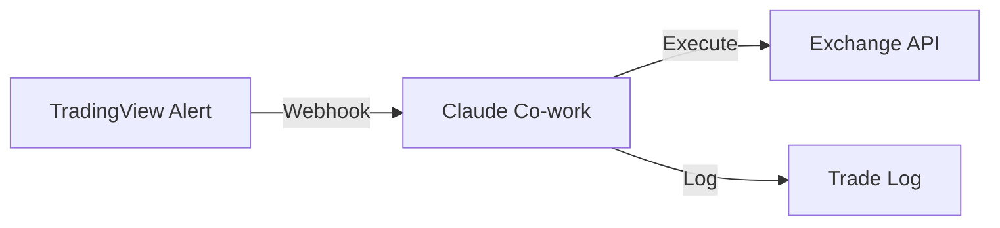

# Claude Co-work

## Definition

Anthropic's agentic AI system that can control a user's computer, access files, run scheduled tasks, and maintain context across sessions and devices. A premium feature of the Claude Desktop app.

## Purpose

Provides an interactive, always-on AI agent for trading workflows that require computer use, file manipulation, and cross-device continuity. Distinct from [[Claude Code]] which is optimized for coding and routines.

## Architecture Role

Alternative runtime in [[Claude-Assisted Trading Stack]]. Suited for crypto trading with exchange UI interaction and webhook-based automation.

## Key Capabilities

| Capability | Description |
|-----------|-------------|
| Computer Use | Control apps, navigate browser, fill forms |
| File Access | Read, edit, create files in designated folders |
| Scheduled Tasks | Automated recurring tasks (daily briefings, scans) |
| Cross-Device Continuity | Start on phone, continue on desktop |
| App Integrations | Slack, Calendar, Notion, GitHub |
| Context Memory | Remembers across sessions |

Source: [[SRC - Claude Cowork Trader]]

## Trading Use Cases

1. **Market Analysis on Demand**: Analyze price action, trend/range detection, long/short recommendation
2. **Trade Journal & Reports**: Read CSV trade history, calculate win rate, risk-reward, worst pairs
3. **Strategy Research**: Research strategies, explain logic, generate Pine Script for [[TradingView Integration]]
4. **Daily Briefings**: Scheduled morning briefings with crypto news and overnight price action
5. **Exchange Execution**: Direct trade execution via exchange API connection

## Exchange Connection

Connects to exchanges via API credentials:
- API key + Secret key + Passphrase (three-factor authentication)
- Enable: trading permissions
- Disable: withdrawal permissions (critical security measure)
- Store credentials via prompt to Claude Co-work

See [[API Credential Isolation]], [[Exchange API Integration]].

## TradingView Webhook Integration

Claude Co-work can bridge TradingView and exchange:

1. Claude generates webhook endpoint
2. TradingView alert sends JSON signal to webhook
3. Claude reads signal and executes trade on exchange

See [[Webhook Architecture]], [[TradingView Integration]].

## Inputs

- User prompts (text or voice)
- File system (designated folders)
- Exchange API credentials
- TradingView webhook signals

## Outputs

- Trade executions
- Analysis reports
- Daily briefings
- File modifications

## Dependencies

- Claude Desktop app
- Claude Pro or Max subscription
- Exchange account with API access
- [[TradingView Integration]] (optional)

## Failure Modes

- Computer use is "research preview" — may be unreliable
- Cross-device sync may lag
- Exchange API connection errors
- Webhook endpoint may need manual maintenance

## Tradeoffs

| Decision | Tradeoff |
|----------|----------|
| Co-work vs. Claude Code | Interactive + computer use vs. code execution + routines |
| Scheduled tasks vs. Routines | Simpler but less programmable |
| Co-work memory vs. file-based | Easier but less transparent/auditable |

## Related Concepts

- [[Claude Code]]
- [[Claude Routines]]
- [[Exchange API Integration]]
- [[TradingView Integration]]
- [[Webhook Architecture]]
- [[Claude-Assisted Trading Stack]]

## Source References

- Source: [[SRC - Claude Cowork Trader]] — complete Co-work trading workflow, exchange connection, webhook setup
