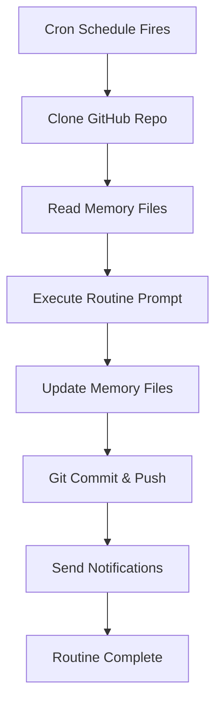

# Claude Routines

## Definition

Scheduled autonomous Claude Code invocations that execute on cron schedules. Each routine clones a git repository, runs a predefined prompt, and can commit/push results back. The mechanism that enables 24/7 autonomous agent operation.

## Purpose

Transforms Claude Code from an interactive tool into an autonomous scheduled agent. Enables pre-market research, market-hours trading, post-market evaluation, and weekly reviews without human intervention.

## Architecture Role

Scheduling and orchestration layer in [[Claude-Assisted Trading Stack]]. Connects [[Claude Code]] runtime to temporal triggers. Each routine fires with a prompt that drives the [[Trading Engine Pipeline]].

## Routine Architecture

## Standard Trading Cron Schedule

| Routine | Schedule | Purpose | Key Actions |
|---------|----------|---------|-------------|
| Pre-Market | 6:00 AM M-F | Research & prep | Perplexity research, catalyst scan, draft trade ideas |
| Market Open | 8:30 AM M-F | Execute trades | Place planned trades, set trailing stops |
| Midday | 12:00 PM M-F | Position management | Cut losers (-7%), tighten winners' stops |
| Market Close | 3:00 PM M-F | End of day | Close day trades, EOD summary, notify |
| Weekly Review | 4:00 PM Friday | Evaluation | Performance vs S&P, strategy grading, learnings |

Source: [[SRC - Claude Opus Trader]]

## Local vs. Remote Routines

| Feature | Local | Remote |
|---------|-------|--------|
| Runs on | Your machine | Anthropic cloud |
| Requires | Desktop app running | GitHub repo |
| Persistence | Direct filesystem | Git commit/push |
| Uptime | Only when computer is on | 24/7 |
| File access | Direct | Cloned repo |

**Critical**: Remote routines MUST commit and push memory file changes back to the GitHub repo. Otherwise, the next routine invocation starts from stale state.

Source: [[SRC - Claude Opus Trader]] — "make sure that it's able to push those changes back to the main repo otherwise the next agent's not going to pick it up"

## Configuration

### Cloud Environment Setup
1. Create cloud environment in Claude Desktop
2. Name it (e.g., "trading")
3. Grant full network access
4. Add environment variables (API keys)
5. Save environment

### Routine Setup
1. Create routine (local or remote)
2. Set cron schedule
3. Assign to cloud environment
4. Paste routine prompt (from `routines/` folder)
5. Enable "Allow unrestricted branch pushes"
6. Test with "Run Now"

### Permissions
Must enable "Allow unrestricted branch pushes" so Claude can push to any branch, not just `claude/` branches.

## Routine Prompt Structure

Each routine prompt must:
1. Instruct agent to read specific memory files first
2. Define the routine's task (research, trade, review, etc.)
3. Specify which API keys to pull from environment variables
4. Instruct agent to update memory files after task
5. Define notification conditions

## Inputs

- Cron schedule
- GitHub repository URL
- Cloud environment (with API keys)
- Routine prompt text

## Outputs

- Executed routine results
- Updated memory files (committed to git)
- Notifications (ClickUp, Slack, Telegram)

## Dependencies

- [[Claude Code]] — runtime
- GitHub — repository hosting for remote routines
- Cloud environment — API key storage
- [[Agent Memory Architecture]] — file-based state

## Failure Modes

- **Missed schedule**: Routine doesn't fire → gap in trading coverage
- **Git push failure**: Memory changes lost → next routine has stale state
- **Environment variable mismatch**: Key names must match EXACTLY letter for letter
- **Token budget**: Heavy routines may exhaust context window
- **Cost accumulation**: 4-5 routines/day across market days

Source: [[SRC - Claude Opus Trader]] — env var naming must be exact: "they weren't spelled exactly word for word letter for letter"

## Tradeoffs

| Decision | Tradeoff |
|----------|----------|
| More routines | Better coverage but higher cost |
| Remote vs. local | Uptime vs. simplicity |
| Rich prompts | Better behavior but consumes token budget |
| Git-based memory | Auditable but merge conflict risk |

## Related Concepts

- [[Claude Code]]
- [[Agent Memory Architecture]]
- [[Stateless Agent Recovery]]
- [[Context Budget Engineering]]
- [[Claude-Assisted Trading Stack]]
- [[Environment Variable Management]]

## Open Questions

- Optimal number of daily routines for different strategies?
- How to handle routine failures gracefully?
- Can routines be chained (output of one → input of next)?
- Cost optimization across subscription tiers?

## Source References

- Source: [[SRC - Claude Opus Trader]] — complete routine setup, cron scheduling, local vs remote, env vars, testing
