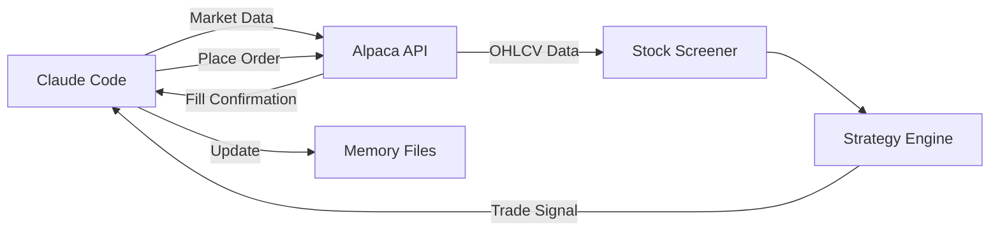

# Alpaca API

## Definition

Commission-free brokerage with a trading API that provides both paper trading and live trading for US equities. The primary execution venue for stock trading in the Claude-assisted ecosystem.

## Purpose

Enables programmatic order placement, position management, and market data access for the [[Trading Engine Pipeline]].

## Architecture Role

Primary brokerage integration in [[Claude-Assisted Trading Stack]]. Connects to [[Trading Engine Pipeline]] Stage 4 (Execution).

## Capabilities

| Feature | Details |
|---------|---------|
| Asset Classes | US stocks, ETFs |
| Paper Trading | Free paper account with $100K virtual balance |
| Live Trading | Real money after account verification |
| Commission | Commission-free |
| API Types | REST API, WebSocket |
| MCP Server | "Trade with natural language" — Alpaca MCP |

## Authentication

Two credentials required:
- **API Key ID**: Identifies the account
- **Secret Key**: Authenticates requests

Generated from the trading API section of the Alpaca dashboard. Both paper and live accounts have separate credential pairs.

**Security**: Store in environment variables. See [[API Credential Isolation]].

```
ALPACA_API_KEY=<key_id>
ALPACA_SECRET_KEY=<secret_key>
```

### Credential File Persistence

For interactive Claude Desktop sessions, credentials can be saved to a local file in the project folder to avoid re-entry each session:

> "Can you make sure in this folder you save these credentials so I don't have to keep giving it to you"

This stores endpoint, key, and secret in a project-local file. Suitable for paper trading development. For live trading, prefer [[Environment Variable Management]] for security.

Source: [[SRC - Claude Alpaca Trader]]

## API Endpoints Used

| Operation | Purpose |
|-----------|---------|
| Get account | Check balance, equity, buying power |
| Get positions | List open positions |
| Create order | Place market/limit/stop orders |
| Cancel order | Cancel pending orders |
| Get bars | Historical OHLCV data |
| Get quotes | Real-time quotes |

## Integration with Trading System



## Paper vs. Live Trading

| Feature | Paper | Live |
|---------|-------|------|
| Balance | $100K virtual (default); custom balances supported (e.g., $50K) | Real funds |
| API URL | paper-api.alpaca.markets | api.alpaca.markets |
| Credentials | Separate key pair | Separate key pair |
| Fills | Simulated (instant) | Real market fills |
| Verification | None | Identity verification required (~days) |

## Inputs

- API credentials (from environment variables)
- Order parameters (symbol, qty, side, type)

## Outputs

- Order confirmations
- Position data
- Account balance
- Historical market data

## Dependencies

- [[Claude Code]] or [[Claude Routines]] — runtime environment
- [[Environment Variable Management]] — credential storage
- [[Position Sizing]] — determines order quantity
- [[Stop-Loss Systems]] — places stop orders

## Failure Modes

- API rate limiting
- Market hours restrictions (no orders outside market hours for equities)
- Account verification delays for live trading
- Key rotation requirements

## Related Concepts

- [[Trading Engine Pipeline]]
- [[Three-Layer Trading System]]
- [[Claude-Assisted Trading Stack]]
- [[Exchange API Integration]]
- [[Paper Trading]]
- [[MCP Architecture]]

## Source References

- Source: [[SRC - Claude Stock Trader]] — "Alpaca, commission-free brokerage that gives you a free API and a paper trading account"
- Source: [[SRC - Claude Opus Trader]] — Alpaca account setup, paper vs live, API key management
- Source: [[SRC - Claude Alpaca Trader]] — custom paper balance, credential file persistence, multiple paper accounts
