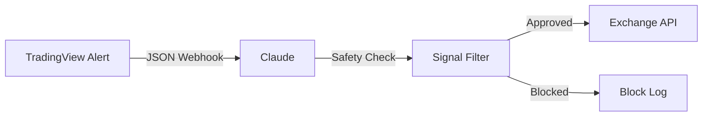

# TradingView Integration

## Definition

The connection between Claude and TradingView for chart reading, indicator visualization, strategy development (Pine Script), and signal-based automation via webhooks and MCP.

## Purpose

Provides the visual and analytical charting layer. Claude reads TradingView charts, applies strategies, and can trigger trades based on TradingView alerts.

## Architecture Role

Data and signal layer in [[Claude-Assisted Trading Stack]]. Feeds into [[Trading Engine Pipeline]] Stage 1 (Research) and Stage 2 (Signal Generation).

## Integration Patterns

### Pattern 1: MCP Connection (Direct)
Claude connects to TradingView via [[MCP Architecture]]. Can read chart data, draw indicators, and analyze price action directly.

Source: [[SRC - Claude TradingView Integration]] (previous video referenced)

### Pattern 2: Webhook Bridge (Claude in the Middle)



TradingView and Exchange never talk directly. Claude sits in the middle, applying strategy rules and safety filters.

Source: [[SRC - Claude TradingView Integration]]

### Pattern 3: Co-work Computer Use
Claude Co-work opens TradingView in the browser, navigates charts, and reads price action via screen interaction.

Source: [[SRC - Claude Cowork Trader]]

## Webhook Configuration

1. Claude generates a webhook endpoint URL
2. In TradingView: Create alert → Webhook URL → paste Claude's URL
3. Alert message formatted as JSON signal:
   ```json
   {"action": "buy", "symbol": "BTCUSDT", "price": 50000}
   ```
4. Claude receives signal, applies safety filter, executes or blocks

## Strategy Development

- Claude can generate Pine Script code for TradingView indicators
- Strategy rules stored in `rules.json` file
- Claude analyzes chart data and applies rules programmatically

Source: [[SRC - Claude Cowork Trader]] — "generate the Pine script code for Trading View"

## Inputs

- TradingView chart data (via MCP or webhook)
- Strategy rules (from rules.json or strategy files)
- Alert configurations

## Outputs

- Trade signals (JSON via webhook)
- Pine Script code
- Chart annotations
- Strategy validation results

## Dependencies

- [[Claude Code]] or [[Claude Co-work]] — runtime
- [[MCP Architecture]] — direct connection
- [[Webhook Architecture]] — signal relay
- [[Exchange API Integration]] — trade execution

## Failure Modes

- MCP connection drops → no chart data
- Webhook endpoint becomes unreachable
- TradingView alert misconfiguration
- Signal JSON format mismatch

## Related Concepts

- [[Claude-Assisted Trading Stack]]
- [[Signal Confirmation]]
- [[Webhook Architecture]]
- [[MCP Architecture]]
- [[Exchange API Integration]]

## Source References

- Source: [[SRC - Claude TradingView Integration]] — complete webhook integration, rules.json, Railway deployment
- Source: [[SRC - Claude Cowork Trader]] — Pine Script generation, webhook setup, computer use pattern
