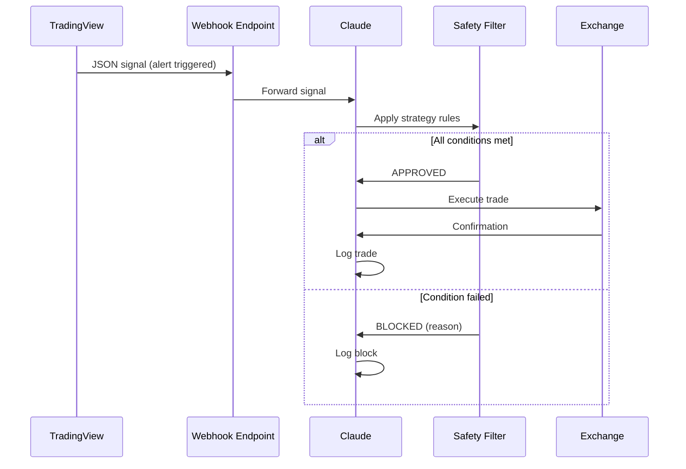

# Webhook Architecture

## Definition

HTTP callback pattern used to relay trading signals from TradingView to Claude, which then executes trades on the exchange. The webhook is the asynchronous communication bridge in the TradingView-Claude-Exchange pipeline.

## Purpose

Enables event-driven trading: TradingView generates signals → webhook notifies Claude → Claude applies strategy filter → Claude executes on exchange.

## Architecture Role

Signal relay mechanism in [[Trading Engine Pipeline]]. Connects [[TradingView Integration]] to [[Exchange API Integration]] with Claude as intermediary.

## Flow



## Configuration

1. Claude generates webhook endpoint URL
2. User configures TradingView alert with webhook URL
3. Alert message formatted as JSON:
   ```json
   {"action": "buy", "symbol": "BTCUSDT", "price": 50000, "qty": 0.1}
   ```
4. Test with small position before production use

Source: [[SRC - Claude Cowork Trader]], [[SRC - Claude TradingView Integration]]

## Inputs

- TradingView alert signals (JSON)
- Strategy rules for validation
- Exchange API credentials

## Outputs

- Executed or blocked trade
- Trade log entry
- Notification to operator

## Dependencies

- [[TradingView Integration]] — signal source
- [[Exchange API Integration]] — execution target
- [[Signal Confirmation]] — validation logic
- [[Railway Deployment]] or server for 24/7 webhook hosting

## Failure Modes

- Webhook endpoint unreachable
- Malformed JSON payload
- Signal latency (market has moved since alert)
- Webhook URL change without updating TradingView

## Related Concepts

- [[TradingView Integration]]
- [[Exchange API Integration]]
- [[Signal Confirmation]]
- [[Railway Deployment]]
- [[Trading Engine Pipeline]]

## Source References

- Source: [[SRC - Claude Cowork Trader]] — webhook generation, TradingView alert setup
- Source: [[SRC - Claude TradingView Integration]] — webhook bridge architecture, JSON signal format
