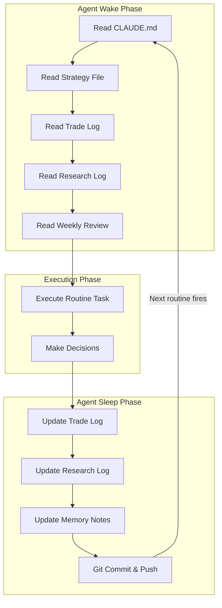

# Agent Memory Architecture

## Definition

The persistent context and memory model that enables stateless Claude agent invocations to behave as a disciplined, continuous trading system. Memory is implemented through structured files that agents read on wake and write before sleep.

## Purpose

Solves the fundamental problem of agentic trading: each routine fires with no inherent state. The agent must reconstruct its operational context, execute its task, and persist any learnings — all through file I/O.

## Architecture Role

Foundation layer. Every other subsystem depends on memory for continuity. Without memory architecture, the system degenerates into isolated, uncoordinated actions.

## Memory Model

## Memory File Types

### Structural Memory (read-mostly)

| File | Purpose | Update Frequency |
|------|---------|-----------------|
| `CLAUDE.md` | Agent identity, rules, constraints | Rarely (manual) |
| `strategy.md` | Trading strategy definition | Weekly or on refinement |
| `commands/` | Skill definitions (research, trade, log) | On skill updates |

### Operational Memory (read-write)

| File | Purpose | Update Frequency |
|------|---------|-----------------|
| `trade-log.md` | Complete trade history | Every trade |
| `research-log.md` | Research findings and catalysts | Every research run |
| `weekly-review.md` | Performance evaluation | Weekly |
| `memory-notes.md` | Ad-hoc learnings, pattern observations | Per run |
| `portfolio-state.md` | Current positions, P&L | Per trade |

### Derived Memory (generated)

| File | Purpose | Update Frequency |
|------|---------|-----------------|
| Performance scorecards | Win rate, risk-reward metrics | Weekly |
| Strategy evolution log | How strategy changed over time | On refinement |

## Key Design Principles

### 1. Files as Personality
Memory files aren't just data — they define the agent's operational character. The `CLAUDE.md` file contains the agent's name, role, guardrails, and behavioral rules. The strategy file encodes trading judgment. Together, they make a stateless LLM act like a disciplined trader.

Source: [[SRC - Claude Opus Trader]] — "files aren't just memory but they're essentially the agent's full personality and discipline"

### 2. Read Before Act
Every routine invocation MUST read its context files before making any decisions. This is non-negotiable — without it, the agent has no strategy, no history, and no constraints.

### 3. Write Before Exit
Every routine invocation MUST persist any new information (trades placed, research findings, learnings) before completing. If the agent exits without writing, that run's work is lost.

### 4. Git as Persistence Layer
For remote [[Claude Routines]], memory files must be committed and pushed to the git repository after each run. The next routine invocation clones the repo and reads the latest state.

Source: [[SRC - Claude Opus Trader]] — "make sure that all of these files that it's actually updating it's able to push back and commit back to that main branch"

## Context Budget Implications

Each file read consumes tokens from the ~200K token budget per routine. Memory architecture must balance completeness against cost. See [[Context Budget Engineering]].

Typical token costs:
- `CLAUDE.md`: ~500-2000 tokens
- `strategy.md`: ~1000-3000 tokens
- `trade-log.md`: grows linearly, may need truncation
- `research-log.md`: grows linearly, may need windowing

## Inputs

- Raw market data (from APIs)
- Previous memory file state (from git)
- Routine-specific instructions (from routine prompt)

## Outputs

- Updated memory files
- Git commits with changes
- Operator notifications (ClickUp, Slack, Telegram)

## Dependencies

- [[Claude Code]] — runtime environment
- [[Claude Routines]] — scheduling layer
- [[Context Budget Engineering]] — token management
- [[Stateless Agent Recovery]] — recovery patterns

## Failure Modes

- **Write failure**: Agent crashes before persisting → lost work
- **Merge conflict**: Two routines modify the same file → corruption
- **Memory bloat**: Unbounded log growth → context budget exceeded
- **Stale read**: Agent reads outdated file → decisions based on old data
- **Git push failure**: Remote routine can't push → next agent starts from stale state

## Tradeoffs

| Decision | Tradeoff |
|----------|----------|
| Comprehensive memory vs. context budget | More files = better context but higher token cost |
| Append-only logs vs. rolling windows | Full history preserves learning but bloats context |
| Single file vs. many files | Monolithic is simpler but harder to selectively read |
| Git-based vs. database | Git is simple and auditable but has merge risks |

## Operational Constraints

- Remote routines require git commit/push for persistence
- Local routines can write directly to filesystem
- Token budget limits how much history the agent can read per invocation
- File locking not available — sequential routine scheduling prevents conflicts

## Related Concepts

- [[Stateless Agent Recovery]]
- [[Context Budget Engineering]]
- [[Trade Logging]]
- [[Claude Routines]]
- [[Trading Engine Pipeline]]
- [[LLM Failure Modes in Trading]]

## Implementation Notes

### Migration Pattern
When migrating from another agent framework (e.g., OpenClaw), export all memory artifacts — strategy, trade history, research notes, agent instructions — and import into the new project structure. Validate that the new agent can read and act on migrated context.

Source: [[SRC - Claude Opus Trader]] — full migration workflow documented

### Institutional Memory (Syndicate Squad)
The [[Supervisor Decision Engine]] implements a higher-order memory pattern: `InstitutionMemoryEntry` records cross-round learning — which upgrades worked, which failed, and why. This is memory about the agent's own decisions.

Source: [[SRC - OWS Dev Squad]]

## Open Questions

- Optimal memory file structure for multi-strategy agents?
- Automatic memory compaction strategies?
- Cross-agent memory sharing patterns?
- Embedding-based memory retrieval at scale?

## Future Extensions

- Vector-indexed memory for semantic retrieval
- Memory versioning with branching (experimental strategies)
- Cross-agent shared memory bus
- Automatic memory summarization for context budget optimization
- Reinforcement learning from trade memory

## Source References

- Source: [[SRC - Claude Opus Trader]] — primary memory architecture, file-based persistence, git push pattern
- Source: [[SRC - OWS Dev Squad]] — institutional memory, cross-round learning
- Source: [[SRC - Claude Stock Trader]] — SQLite database for market data storage
- Source: [[SRC - LLM Wiki Methodology]] — persistent synthesis as memory pattern
