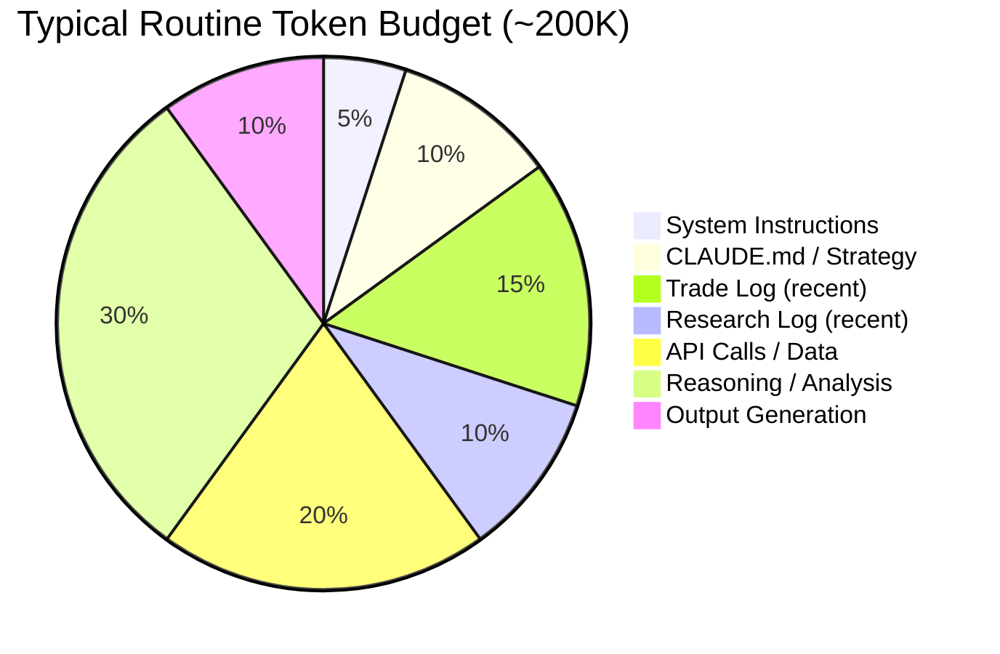

# Context Budget Engineering

## Definition

The discipline of managing token consumption within LLM agent invocations to maximize reasoning quality while staying within context window limits. Treats tokens as a finite resource analogous to a financial budget.

## Purpose

Prevents context overflow, maintains reasoning quality, and ensures each routine invocation can complete its task within token constraints.

## Architecture Role

Foundation constraint on [[Agent Memory Architecture]]. Every design decision about what to read, write, and process must account for context budget.

## Mental Model

> "Treat tokens like money. Every file that you ask the agent to read is going to cost you."

Source: [[SRC - Claude Opus Trader]]

## Budget Structure



### Budget Categories

| Category | Allocation | Notes |
|----------|-----------|-------|
| System instructions | ~10K | Claude Code overhead |
| Structural memory | ~20K | CLAUDE.md, strategy, commands |
| Operational memory | ~30K | Trade log, research log (windowed) |
| Live data ingestion | ~40K | API responses, market data |
| Reasoning / analysis | ~60K | Core agent computation |
| Output generation | ~20K | Reports, notifications, file updates |
| Buffer | ~20K | Safety margin |

## Optimization Strategies

### 1. Selective Reading
Don't read everything. Each routine type needs different files:
- **Pre-market**: Strategy + research log + watchlist → skip trade log
- **Market open**: Strategy + trade log + watchlist → skip deep research
- **Midday**: Trade log + open positions → minimal context
- **Close**: Trade log + portfolio state → evaluation focus
- **Weekly review**: Everything (heaviest context load)

### 2. Memory Windowing
For growing logs, read only the most recent entries:
- Trade log: last N trades (e.g., last 20)
- Research log: last session's findings
- Historical: only when doing weekly review

### 3. Context Resets
Clear context between logical task boundaries:
- Summarize current state
- `/clear` to reset context window
- Re-inject summary into fresh context
- Continue with full budget available

Source: [[SRC - Claude Opus Trader]] — "give me a summary of what we've done, then /clear, then paste summary"

### 4. Prompt Engineering for Token Efficiency
- Concise routine prompts (specify exactly what to read/do)
- "Read these files" not "figure out what you need"
- Structured output formats reduce token waste

### 5. Tiered File Architecture
Separate high-priority files (always read) from low-priority (read on demand):

```
Always Read:
  CLAUDE.md
  strategy.md

Read Per Routine Type:
  trade-log.md (market routines)
  research-log.md (pre-market)
  weekly-review.md (weekly only)

Read On Demand:
  historical-trades/
  archived-research/
```

## Context Window Sizes

| Model | Context Window | Practical Budget |
|-------|---------------|-----------------|
| Claude Opus 4.6 | 200K tokens | ~180K usable |
| Claude Opus 4.6 (1M) | 1M tokens | ~900K usable |

Note: Even with 1M context, quality degrades with heavy loading due to context rot. Target the minimum necessary context, not the maximum available.

## Inputs

- Token limits per model
- File sizes of memory artifacts
- Routine task requirements

## Outputs

- Per-routine file reading plan
- Memory compaction schedule
- Context reset strategy

## Dependencies

- [[Agent Memory Architecture]]
- [[Claude Routines]]
- [[Claude Code]]

## Failure Modes

- **Budget exceeded**: Routine can't complete → incomplete analysis or truncated output
- **Under-budgeted reasoning**: Too much context, too little reasoning → poor decisions
- **Context rot**: Important early information lost in long context → wrong conclusions
- **Stale summary**: Context reset with outdated summary → decisions on old state

## Tradeoffs

| Decision | Tradeoff |
|----------|----------|
| More context = more information | vs. slower, more expensive, context rot risk |
| Windowed memory = fast | vs. loses historical patterns |
| Frequent resets = fresh context | vs. loses accumulated reasoning |
| Minimal reads = cheap | vs. may miss relevant context |

## Related Concepts

- [[Agent Memory Architecture]]
- [[LLM Failure Modes in Trading]]
- [[Stateless Agent Recovery]]
- [[Claude Routines]]

## Open Questions

- Formal model for optimal context allocation across routine types?
- Automated token budgeting based on task complexity?
- Context quality metrics (how to measure "rot")?

## Future Extensions

- Dynamic context budget allocation based on market volatility
- Automatic memory compaction triggered by budget thresholds
- Semantic relevance scoring for selective file loading
- Multi-pass analysis with context resets between passes

## Source References

- Source: [[SRC - Claude Opus Trader]] — "treat tokens like money", context reset pattern, routine budget ~200K
- Source: [[SRC - LLM Wiki Methodology]] — index-based navigation as context optimization
