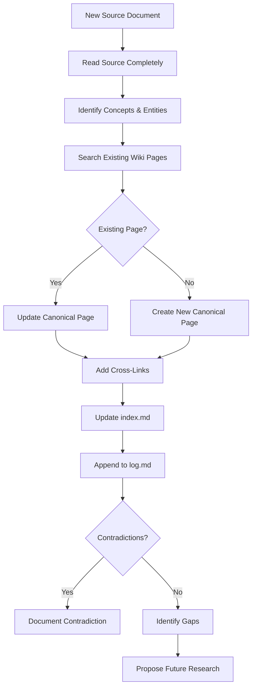
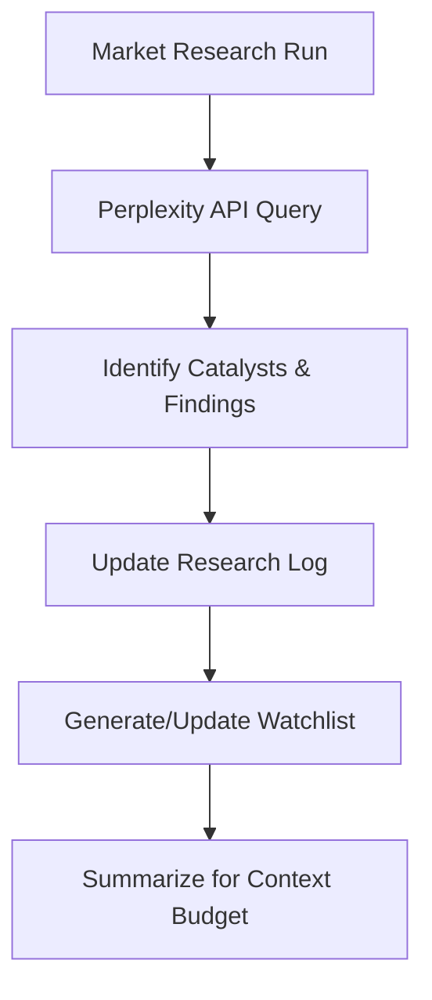

# Research Ingestion Workflow

## Definition

The standardized process for incorporating new source material into the wiki knowledge graph and into the trading system's operational knowledge. Applies both to wiki maintenance and to the trading agent's market research ingestion.

## Purpose

Ensures every new source is systematically decomposed, cross-referenced, and integrated rather than superficially summarized. Prevents knowledge loss and maintains graph consistency.

## Architecture Role

Entry point for all new information. Feeds [[Agent Memory Architecture]], [[Trading Engine Pipeline]] (research stage), and the wiki itself.

## Wiki Ingestion Workflow

### Steps

1. **Read**: Complete source document, noting key claims, systems, entities
2. **Identify**: Extract all concepts, architectures, workflows, tools, patterns
3. **Search**: Check existing wiki for each identified concept
4. **Update/Create**: Update existing canonical pages or create new ones
5. **Cross-link**: Add bidirectional links between related pages
6. **Index**: Add any new pages to `index.md`
7. **Log**: Append timestamped entry to `log.md`
8. **Contradictions**: Flag conflicts with existing wiki content
9. **Gaps**: Identify missing architecture pieces
10. **Future research**: Propose areas for additional investigation

Source: [[SRC - LLM Wiki Methodology]]

## Trading Research Ingestion

The trading agent's pre-market research follows a parallel pattern:

### Pre-Market Research Routine

The 6:00 AM pre-market routine:
1. Query [[Perplexity API]] for market-moving news and catalysts
2. Analyze overnight price action on key watchlist instruments
3. Cross-reference catalysts with current [[Agent Memory Architecture|strategy files]]
4. Draft trade ideas for the day
5. Update research log with findings
6. Notify operator only if urgent

Source: [[SRC - Claude Opus Trader]]

## Source Processing Rules

### For Wiki Sources
- Raw documents in `/raw/` are IMMUTABLE — never modify
- Create summary pages in `/wiki/sources/` prefixed with `SRC -`
- Each source page contains: metadata, key claims, extracted concepts, contradictions

### For Market Research
- Research findings stored in `research-log.md`
- Catalysts flagged with timestamp and confidence level
- Cross-referenced with existing watchlist and positions

## Quality Criteria

Good ingestion produces:
- Zero orphan concepts (every concept linked to at least one other)
- Complete source traceability (every claim cites its source)
- No semantic duplicates (checked before creation)
- Updated hub pages (Architecture Overview, Trading Engine Pipeline, etc.)

Bad ingestion produces:
- Standalone summary pages with no outbound links
- Duplicated explanations already covered elsewhere
- Generic prose without technical specificity
- Missing index entries

## Inputs

- Raw source document (markdown, PDF, transcript)
- Existing wiki state
- Previous ingestion log

## Outputs

- Updated/new canonical pages
- Updated index.md
- New log.md entry
- Contradiction documentation (if any)
- Gap analysis and research proposals

## Dependencies

- [[CLAUDE.md|Wiki Maintenance Schema]] — canonicalization rules
- [[Agent Memory Architecture]] — memory file structures
- [[Perplexity API]] — market research tool

## Failure Modes

- **Shallow ingestion**: Source summarized but not decomposed into concepts
- **Orphan creation**: New pages created without links to existing graph
- **Duplicate creation**: New page for concept already covered
- **Missing contradictions**: Conflicting claims silently merged
- **Index desync**: New pages not added to index

## Related Concepts

- [[Architecture Overview]]
- [[Agent Memory Architecture]]
- [[Context Budget Engineering]]
- [[Trading Engine Pipeline]]

## Future Extensions

- Automated source classification (research paper, tutorial, news, API docs)
- Batch ingestion with dependency resolution
- Contradiction detection via semantic similarity
- Source quality scoring
- Automatic gap analysis against wiki schema

## Source References

- Source: [[SRC - LLM Wiki Methodology]] — canonical ingestion workflow (3-layer architecture)
- Source: [[SRC - Claude Opus Trader]] — pre-market research routine, Perplexity integration
