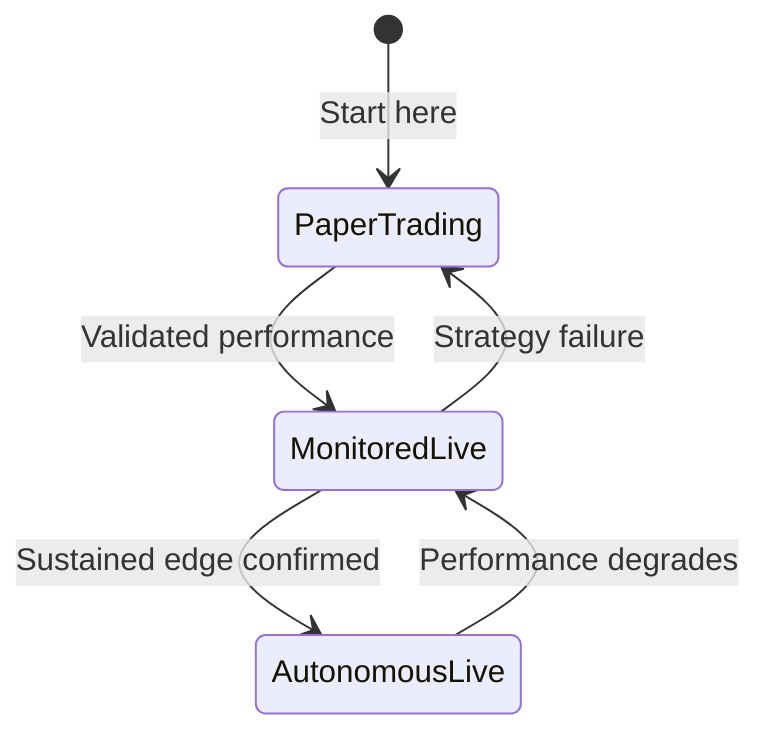

# Autonomous Trading Risk Model

## Definition

Comprehensive model of all operational and financial risks in Claude-assisted autonomous trading. Covers market risk, execution risk, system risk, AI-specific risk, and governance risk.

## Purpose

Provides a canonical risk taxonomy for evaluating, mitigating, and monitoring risks across all autonomous trading architectures in the ecosystem.

## Architecture Role

Cross-cutting concern. Risk constraints are enforced at multiple pipeline stages: [[Position Sizing]], [[Guardrail Architecture]], [[Paper Trading]], and [[Stop-Loss Systems]].

## Risk Taxonomy

```mermaid
flowchart TD
    R[Autonomous Trading Risks] --> MR[Market Risk]
    R --> ER[Execution Risk]
    R --> SR[System Risk]
    R --> AR[AI-Specific Risk]
    R --> GR[Governance Risk]

    MR --> MR1[Adverse price movement]
    MR --> MR2[Volatility regime change]
    MR --> MR3[Liquidity gaps]
    MR --> MR4[Correlation breakdown]

    ER --> ER1[Slippage]
    ER --> ER2[Partial fills]
    ER --> ER3[API latency]
    ER --> ER4[Order rejection]

    SR --> SR1[API downtime]
    SR --> SR2[Memory corruption]
    SR --> SR3[Git push failure]
    SR --> SR4[Routine scheduling failure]

    AR --> AR1[Hallucinated signals]
    AR --> AR2[Overfitting]
    AR --> AR3[Stale context]
    AR --> AR4[Context overflow]

    GR --> GR1[Credential exposure]
    GR --> GR2[Unauthorized trading]
    GR --> GR3[Regulatory violation]
    GR --> GR4[Audit trail gaps]
```



## Risk Categories

### Market Risk

| Risk | Description | Mitigation |
|------|-------------|------------|
| Adverse movement | Price moves against position | [[Stop-Loss Systems]], position limits |
| Volatility regime | Strategy optimized for wrong regime | [[Walk-Forward Optimization]], regime detection |
| Liquidity gaps | Can't exit at expected price | [[Relative Volume Filter]], volume minimums |
| Drawdown | Sustained portfolio decline | Daily loss cap, max drawdown limit |

### Execution Risk

| Risk | Description | Mitigation |
|------|-------------|------------|
| Slippage | Execution price differs from signal price | Limit orders, slippage budget |
| API latency | Delay between decision and execution | Timeout handling, retry logic |
| Rate limiting | Exchange throttles API calls | Rate limiter in execution engine |
| Partial fills | Order only partially executed | Fill-or-kill orders, position reconciliation |

### System Risk

| Risk | Description | Mitigation |
|------|-------------|------------|
| Routine failure | Scheduled cron doesn't fire | Monitoring, redundant scheduling |
| Memory corruption | File state inconsistent | Sequential scheduling, atomic writes |
| Git push failure | Remote routine can't persist | Retry logic, local fallback |
| Environment misconfiguration | Wrong API keys, missing env vars | Startup validation, health checks |

### AI-Specific Risk

See [[LLM Failure Modes in Trading]] for detailed treatment.

| Risk | Description | Mitigation |
|------|-------------|------------|
| Hallucinated signals | LLM generates false technical analysis | [[Signal Confirmation]], multi-indicator validation |
| Overfitting | Strategy memorizes past data | [[Walk-Forward Optimization]], out-of-sample testing |
| Stale context | Agent acts on outdated memory | Fresh data reads, timestamp validation |
| Context overflow | Too many files → budget exceeded | [[Context Budget Engineering]], selective reads |
| Invalid assumptions | LLM reasons incorrectly about markets | Guardrails, hard-coded limits |

### Governance Risk

| Risk | Description | Mitigation |
|------|-------------|------------|
| Credential exposure | API keys leaked in code/logs | [[API Credential Isolation]], env vars only |
| Unauthorized trading | Agent exceeds intended scope | Permission scoping, withdrawal disabled |
| Audit gaps | Trades without documentation | [[Trade Logging]], mandatory journaling |
| Regulatory | Algorithmic trading compliance | Paper trading stage gate, position limits |

## Risk Parameters

Standard guardrail configuration:

```
max_position_pct: 5%          # Max portfolio % per position
max_positions: 3-5             # Max concurrent positions
daily_loss_cap: varies         # Max daily loss before halt
stop_loss_pct: 1-3%            # Per-position stop loss
trailing_stop: 10%             # Trailing stop percentage
max_trades_per_day: varies     # Rate limit on trade frequency
paper_trading: true/false      # Gate for live execution
withdrawal_enabled: false      # NEVER enable withdrawal via API
```

Source: [[SRC - Claude Opus Trader]], [[SRC - Claude TradingView Integration]]

## Phased Risk Mitigation



1. **Paper Trading**: Full system runs with simulated execution. Validate pipeline, signals, memory, and logging.
2. **Monitored Live**: Real money, small positions, operator reviews every run.
3. **Autonomous Live**: Proven system runs independently with guardrails.

Source: [[SRC - Claude Opus Trader]] — "start with paper trading first"

## Dependencies

- [[Guardrail Architecture]]
- [[Position Sizing]]
- [[Stop-Loss Systems]]
- [[Paper Trading]]
- [[Trade Logging]]
- [[API Credential Isolation]]

## Failure Modes

This page IS the failure mode catalog for the trading system. See individual risk categories above.

## Tradeoffs

| Decision | Tradeoff |
|----------|----------|
| Tight stops vs. wide stops | Less loss per trade but more false stop-outs |
| Few positions vs. many | Concentrated risk vs. diversification costs |
| Paper trading duration | Longer validation vs. delayed real returns |
| Autonomy level | Less oversight = more risk but more scalable |

## Operational Constraints

- API withdrawal permissions MUST be disabled
- Paper trading mode required before live trading
- Daily loss caps are non-negotiable
- Every trade must be logged — no silent execution

## Related Concepts

- [[Architecture Overview]]
- [[Trading Engine Pipeline]]
- [[LLM Failure Modes in Trading]]
- [[Guardrail Architecture]]
- [[Paper Trading]]

## Open Questions

- Optimal daily loss cap as % of portfolio?
- Dynamic risk adjustment based on market regime?
- Portfolio-level risk vs. per-position risk optimization?
- Automated circuit breaker design?

## Future Extensions

- Value-at-Risk (VaR) computation
- Monte Carlo risk simulation
- Regime-aware dynamic risk parameters
- Cross-asset correlation risk management
- Portfolio optimization with risk constraints (Markowitz, Black-Litterman)

## Source References

- Source: [[SRC - Claude Opus Trader]] — guardrail configuration, phased trading
- Source: [[SRC - Claude Stock Trader]] — overfitting detection, walk-forward validation
- Source: [[SRC - Claude TradingView Integration]] — safety filter, paper trading mode, trade size limits
- Source: [[SRC - Claude Cowork Trader]] — exchange API security, withdrawal disabled
- Source: [[SRC - OWS Dev Squad]] — paper trading engine, evaluation scoring
