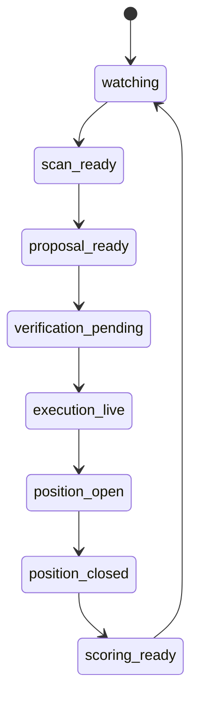

# Paper Trading

## Definition

Simulated trading execution using real market data but without actual capital at risk. A required validation stage before deploying strategies with real money.

## Purpose

Validates the entire trading pipeline — signals, execution, memory, logging — without financial risk. Proves system correctness before capital deployment.

## Architecture Role

Stage gate in the [[Autonomous Trading Risk Model]] phased risk mitigation pipeline. All strategies must pass paper trading before live promotion.

## Implementation Variants

### Alpaca Paper Trading
- Built-in paper trading account with virtual $100K
- Same API endpoints as live trading
- Accessed via separate paper trading API credentials

Source: [[SRC - Claude Stock Trader]], [[SRC - Claude Opus Trader]]

#### Custom Balance Paper Accounts

Alpaca supports creating multiple paper trading accounts with custom balances (e.g., $50K instead of the default $100K). This enables:
- **Strategy isolation**: Separate paper accounts for each strategy (e.g., "Trading Claude" for trailing stops, "Son" for copy trading)
- **Realistic capital simulation**: Set balance to match intended live capital
- **Independent performance tracking**: Each strategy's returns measured against its own starting capital

Source: [[SRC - Claude Alpaca Trader]]

### TradingView Paper Mode
- Controlled via `PAPER_TRADING=true` environment variable
- Toggle to live: tell Claude "I want to make it with real money trading now"
- All trades logged identically to live mode

Source: [[SRC - Claude TradingView Integration]]

### Syndicate Squad Paper Trading Engine
Full propose → verify → execute → close → score cycle with demo market data:

Generates scorecards that feed back into [[Supervisor Decision Engine]] as evidence for upgrade decisions. See [[SRC - OWS Dev Squad]].

## Promotion Criteria

### From Paper to Live
1. Validated strategy via [[Walk-Forward Optimization]]
2. Paper trading results consistent with backtest expectations
3. All system components (logging, memory, notifications) working
4. Human review and explicit approval

### Syndicate Squad Promotion Logic
Deterministic criteria:
- At least 3 metrics improved
- No regressions
- Average relative improvement ≥ 12%

Source: [[SRC - OWS Dev Squad]]

## Inputs

- Strategy rules
- Real market data
- Virtual account balance

## Outputs

- Simulated trade results
- Performance metrics
- System validation evidence

## Dependencies

- [[Alpaca API]] (paper mode) or [[Exchange API Integration]]
- [[Trading Engine Pipeline]]
- [[Trade Logging]]

## Failure Modes

- **Behavior divergence**: Paper and live environments may differ (fill assumptions, latency)
- **False confidence**: Success in paper trading doesn't guarantee live success
- **Insufficient duration**: Too short a paper trading period → not statistically significant

## Related Concepts

- [[Autonomous Trading Risk Model]]
- [[Walk-Forward Optimization]]
- [[Guardrail Architecture]]
- [[Supervisor Decision Engine]]
- [[Trade Logging]]

## Source References

- Source: [[SRC - Claude Stock Trader]] — Alpaca paper trading
- Source: [[SRC - Claude Opus Trader]] — "start with paper trading first"
- Source: [[SRC - Claude TradingView Integration]] — paper trading mode toggle, env var control
- Source: [[SRC - OWS Dev Squad]] — paper trading engine with evaluation scoring
- Source: [[SRC - Claude Alpaca Trader]] — custom balance paper accounts ($50K), multiple accounts for strategy isolation
