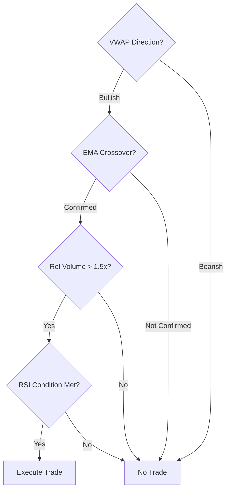

# Signal Confirmation

## Definition

The pattern of requiring multiple independent indicators to agree before executing a trade. No single indicator triggers a trade alone — all conditions in the indicator stack must be satisfied simultaneously.

## Purpose

Reduces false signals and increases trade conviction by requiring convergence across independent analytical dimensions (trend, momentum, volume).

## Architecture Role

Validation gate in [[Trading Engine Pipeline]] Stage 2 (Signal Generation). Implemented across all strategy variants in the ecosystem.

## Confirmation Pattern



## Standard Indicator Stack

### Three-Layer System (Equities)
All three must be true:
1. **[[VWAP]]**: Price above VWAP (bullish) or below (bearish)
2. **[[EMA Crossover]]**: 9/21 EMA confirms momentum direction
3. **[[Relative Volume Filter]]**: Volume ≥ 1.5x average

Source: [[SRC - Claude Stock Trader]]

### TradingView Scalping System (Crypto)
All conditions must be true for BUY:
1. Price above VWAP
2. Price above 8 EMA (uptrend)
3. RSI drops below 30 (oversold pullback in uptrend)

All conditions must be true for SELL:
1. Corresponding sell signal conditions

Source: [[SRC - Claude TradingView Integration]]

## Safety Filter Extension

Beyond indicator confirmation, the [[Guardrail Architecture]] adds portfolio-level checks:

```
IF all_indicators_pass:
    IF position_size_ok AND exposure_ok AND daily_loss_ok:
        EXECUTE
    ELSE:
        BLOCK (with reason)
ELSE:
    NO TRADE (log which condition failed)
```

When a trade is blocked, the system logs WHICH specific condition failed and the actual value that was observed. This enables debugging and strategy refinement.

Source: [[SRC - Claude TradingView Integration]] — "it showed us the variety of indicators... and then it did the safety check and blocked the trade... the RSI was 38.26 and it needs to be below 30"

## Inputs

- Indicator values (computed, not estimated)
- Strategy rules (from strategy file / rules.json)
- Portfolio state

## Outputs

- Trade signal: EXECUTE or NO TRADE
- Per-condition pass/fail status
- Actual indicator values at decision time

## Dependencies

- [[VWAP]]
- [[EMA Crossover]]
- [[Relative Volume Filter]]
- Market data (real-time)

## Failure Modes

- **Over-filtering**: Too many conditions → too few trades → missed opportunities
- **Correlated indicators**: Conditions that seem independent but are correlated → false sense of confirmation
- **LLM indicator estimation**: If LLM estimates rather than computes indicator values → hallucinated signals. See [[LLM Failure Modes in Trading]].

## Tradeoffs

| Decision | Tradeoff |
|----------|----------|
| More conditions | Higher conviction but fewer signals |
| Strict thresholds | Fewer false signals but more missed trades |
| Static vs. adaptive | Simpler vs. regime-responsive |

## Related Concepts

- [[VWAP]]
- [[EMA Crossover]]
- [[Relative Volume Filter]]
- [[Guardrail Architecture]]
- [[Trading Engine Pipeline]]
- [[Three-Layer Trading System]]
- [[Overfitting Detection]]

## Open Questions

- Optimal number of confirmation conditions?
- How to measure correlation between indicators?
- Adaptive confirmation thresholds based on market regime?

## Source References

- Source: [[SRC - Claude Stock Trader]] — three-indicator stack (VWAP + EMA + RVOL)
- Source: [[SRC - Claude TradingView Integration]] — VWAP + EMA + RSI stack, safety filter logging
