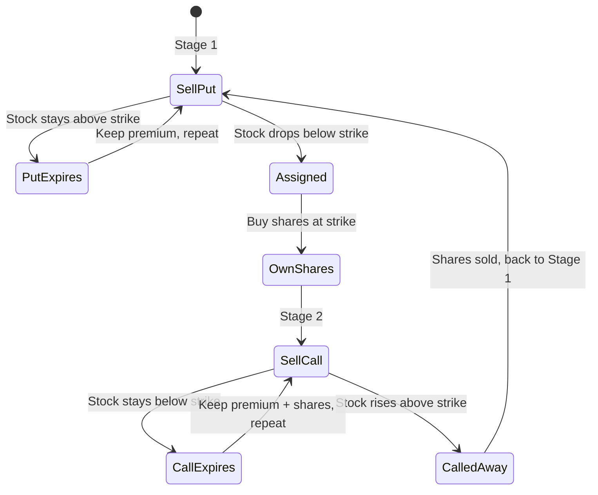

# Wheel Strategy

## Definition

Cyclical income-generation strategy that rotates through selling cash-secured puts and covered calls on the same underlying stock, collecting premium at every stage regardless of price direction. Each rotation through the cycle generates income; the strategy repeats indefinitely.

## Purpose

Generates consistent premium income from stocks the trader is willing to own. Unlike directional strategies that require the stock to move a specific way, the Wheel profits in up, down, and sideways markets.

> "Every single rotation you get paid. The stock can go up, down, sideways. It doesn't matter. You're collecting income at every stage."

Source: [[SRC - Claude Alpaca Trader]]

## Architecture Role

Options-based strategy variant in [[Trading Engine Pipeline]]. Extends the strategy layer beyond indicator-based momentum/trend strategies (see [[Signal Confirmation]]) to income generation via [[Options Trading]]. Requires explicit enablement in [[Guardrail Architecture]] (overrides default "no options" configuration in some implementations).

## Strategy Cycle

## Stage 1: Sell Cash-Secured Put

Pick a stock you want to own but at a lower price. Sell a put option with strike below current price.

**Mechanics**:
- Select strike price ~10% below current market price
- Choose expiration 2-4 weeks out
- Collect premium immediately
- Must hold enough cash to buy 100 shares at strike if assigned ("cash-secured")

**Example** (Tesla at $250):
- Sell put at $230 strike
- Collect $5/share premium ($500 for 1 contract = 100 shares)
- If Tesla stays above $230: contract expires, keep $500, sell another put
- If Tesla drops below $230: obligated to buy 100 shares at $230, but effective cost is $225 (strike minus premium collected)

> "You got Tesla cheaper than anyone else and you wanted it anyways."

Source: [[SRC - Claude Alpaca Trader]]

## Stage 2: Sell Covered Call

Once shares are owned (from put assignment), sell call options against them.

**Mechanics**:
- Select strike price ~10% above cost basis
- Choose expiration 2-4 weeks out
- Collect premium immediately
- Already own the shares, so the call is "covered"

**Example** (own Tesla at $225 effective cost):
- Sell call at $260 strike
- Collect $5/share premium ($500)
- If Tesla stays below $260: contract expires, keep shares + $500, sell another call
- If Tesla rises above $260: shares sold at $260, return to Stage 1

**Full Cycle P&L**:

| Component | Per Share | Total (100 shares) |
|-----------|----------|-------------------|
| Stock gain ($225 → $260) | $35 | $3,500 |
| Put premium collected | $5 | $500 |
| Call premium collected | $5 | $500 |
| **Total profit** | **$45** | **$4,500** |

Source: [[SRC - Claude Alpaca Trader]]

## Hard Rules

These map to [[Guardrail Architecture]] constraints for Wheel Strategy execution:

| Rule | Rationale |
|------|-----------|
| Never sell a put unless cash is available to buy shares if assigned | Prevents naked put exposure |
| Never sell a call below cost basis | Prevents locking in a loss on shares |
| Track premium across all cycles | Enables accurate total return calculation |
| If contract hits 50% profit before expiration, close early | Captures majority of premium with reduced risk |
| Do nothing outside market hours | Prevents off-hours execution errors |

Source: [[SRC - Claude Alpaca Trader]]

## Strike and Expiration Selection

| Parameter | Puts (Stage 1) | Calls (Stage 2) |
|-----------|----------------|-----------------|
| Strike distance | ~10% below current price | ~10% above cost basis |
| Expiration | 2-4 weeks out | 2-4 weeks out |
| Early close trigger | 50% profit | 50% profit |

## Monitoring Schedule

Claude checks positions every 15 minutes during market hours via [[Claude Routines]] `/schedule` command:

- Monitor assignment status
- Evaluate early close opportunities (50% profit target)
- Assess roll decisions (close current, open new expiration)
- Track stage transitions (put → shares → call → cash → put)
- Generate daily summary at market close

Source: [[SRC - Claude Alpaca Trader]]

## Claude Automation

Claude handles the full management lifecycle:

| Task | Automation |
|------|-----------|
| Position monitoring | Every 15 minutes via cron |
| Strike/expiration selection | Based on rules (10% distance, 2-4 week expiry) |
| Premium tracking | Cumulative across all cycles |
| Assignment detection | Auto-transition from Stage 1 to Stage 2 |
| Contract rolling | Close expiring, open new when appropriate |
| Stage transitions | Automatic cycle progression |
| Daily summary | Market close report |

> "Claude handles all of it — Claude itself can monitor the positions, pick expirations, and roll contracts when needed. You just collect the premiums on a schedule."

Source: [[SRC - Claude Alpaca Trader]]

## Inputs

- Underlying stock selection (must be willing to own)
- Account cash balance (must cover put assignment)
- Risk tolerance (strike distance percentage)
- Target expiration window (2-4 weeks)
- Monitoring interval (15 minutes recommended)

## Outputs

- Premium income per cycle (tracked cumulatively)
- Assignment/exercise events with stage transitions
- Position state (which stage of the wheel)
- Daily summaries at market close
- Cycle completion P&L reports

## Dependencies

- [[Options Trading]] — foundational concept (calls, puts, premiums)
- [[Alpaca API]] — options-enabled brokerage account
- [[Position Sizing]] — cash requirement calculations for put selling
- [[Claude Routines]] — 15-minute monitoring schedule
- [[Stop-Loss Systems]] — implicit downside limit via put strike selection
- [[Paper Trading]] — required validation before live deployment
- [[Guardrail Architecture]] — options trading must be explicitly enabled
- [[Trade Logging]] — premium and cycle tracking

## Failure Modes

- **Sustained downturn**: Stock drops significantly below put strike → large unrealized loss on shares, unable to sell calls above cost basis
- **Early assignment**: Disrupts planned cycle timing, requires immediate stage transition
- **Gap through strike**: Stock gaps past strike on earnings/news → worse execution than planned
- **Illiquid options**: Wide bid-ask spreads increase execution cost, reduce premium captured
- **Margin call**: Insufficient cash to cover assignment if other positions consume capital
- **Inability to sell calls above cost basis**: In deep drawdown, no premium can be collected without locking in a loss

## Tradeoffs

| Decision | Tradeoff |
|----------|----------|
| Consistent income | Capped upside when shares are called away |
| Forced stock purchase on assignment | Discount entry but no choice on timing |
| Short expiration (2 weeks) | Higher annualized premium but more management |
| Long expiration (4 weeks) | Less management but lower annualized premium |
| Close-to-money strikes | Higher premium but higher assignment probability |
| Far-from-money strikes | Lower premium but more room for price movement |

## Related Concepts

- [[Options Trading]]
- [[Signal Confirmation]] — contrast: Wheel does not use indicator-based signals
- [[Guardrail Architecture]]
- [[Autonomous Trading Risk Model]]
- [[Position Sizing]]
- [[Claude Routines]]
- [[Alpaca API]]
- [[Paper Trading]]
- [[Stop-Loss Systems]]
- [[Trading Engine Pipeline]]
- [[Trade Logging]]

## Open Questions

- Optimal delta for strike selection beyond the 10% heuristic?
- How to handle earnings events (close positions before, skip that week)?
- Portfolio-level wheel management across multiple underlying stocks?
- Integration with technical analysis for timing put entries?
- Greeks monitoring for position management optimization?

## Future Extensions

- Multi-stock wheel portfolio with sector diversification
- Delta-based strike selection (replace fixed 10% with delta targeting)
- IV rank filtering — only sell when implied volatility is elevated
- Earnings calendar integration — skip or adjust around earnings
- Greeks-aware roll decision engine
- Performance comparison framework across different underlyings

## Source References

- Source: [[SRC - Claude Alpaca Trader]] — complete Wheel Strategy walkthrough, Tesla example, P&L math, hard rules, Claude automation, 15-minute monitoring schedule
