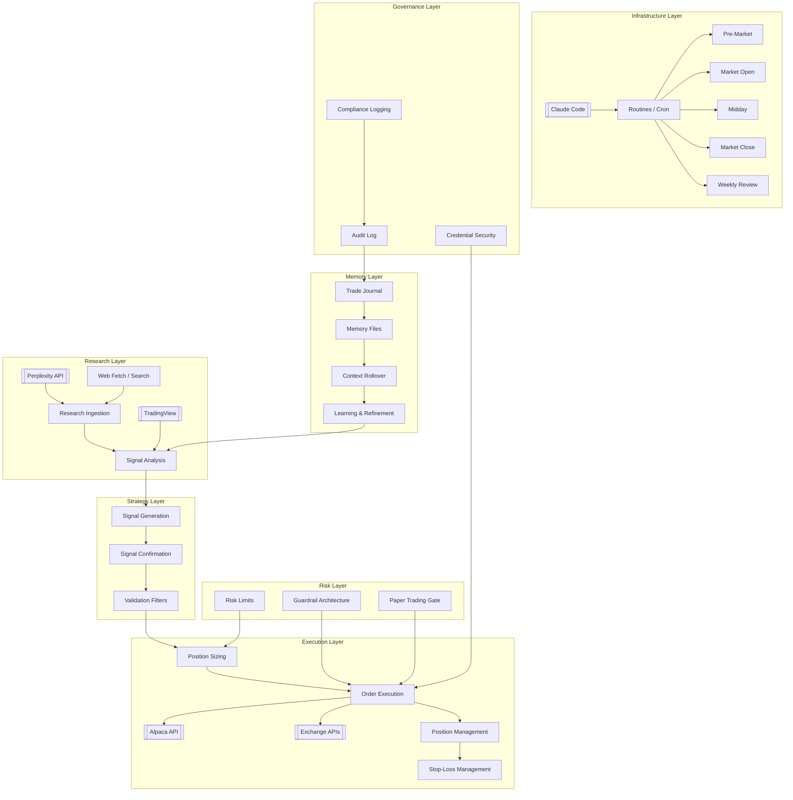

# Architecture Overview

## Definition

High-level map of the Claude-assisted autonomous trading ecosystem. This page is the root node of the wiki graph — all major subsystems, integrations, and workflows link from here.

## System Map

## Core Subsystems

| Subsystem | Canonical Page | Domain |
|-----------|---------------|--------|
| Research | [[Research Ingestion Workflow]] | `/research` |
| Signal Generation | [[Signal Confirmation]] | `/strategies` |
| Execution | [[Trading Engine Pipeline]] | `/execution` |
| Memory | [[Agent Memory Architecture]] | `/memory` |
| Risk | [[Autonomous Trading Risk Model]] | `/risk` |
| Context | [[Context Budget Engineering]] | `/memory` |
| Infrastructure | [[Claude-Assisted Trading Stack]] | `/infrastructure` |
| Agent Orchestration | [[Multi-Agent Orchestration]] | `/agents` |
| Governance | [[API Credential Isolation]] | `/security` |

## Design Principles

1. **Stateless agent, persistent memory**: Each routine invocation starts with no state; discipline comes from reading files. See [[Stateless Agent Recovery]].
2. **File-based memory over database**: Strategy, trade logs, research notes, and learnings stored as markdown/JSON files committed to git. See [[Agent Memory Architecture]].
3. **Phased autonomy**: Paper trading → monitored live → autonomous live. See [[Paper Trading]].
4. **Context as currency**: Every file read costs tokens. Budget carefully. See [[Context Budget Engineering]].
5. **Guardrails before autonomy**: Position limits, daily loss caps, and permission scoping precede any live execution. See [[Guardrail Architecture]].

## Architectural Layers

### Layer 1: Data Ingestion
- Market data from [[TradingView Integration]], [[Alpaca API]]
- News/research from [[Perplexity API]], web search
- Historical data for [[Backtesting Methodology]]

### Layer 2: Analysis & Strategy
- Technical indicators: [[VWAP]], [[EMA Crossover]], [[Relative Volume Filter]]
- Strategy patterns: [[VWAP Crossover Strategy]], momentum systems
- Validation: [[Walk-Forward Optimization]], [[Overfitting Detection]]

### Layer 3: Execution
- Order management via [[Alpaca API]] or [[Exchange API Integration]]
- [[Position Sizing]] based on account equity and risk parameters
- [[Stop-Loss Systems]] for downside protection
- [[Trade Logging]] for compliance and learning

### Layer 4: Memory & Learning
- [[Agent Memory Architecture]] for cross-session persistence
- [[Trade Journal]] for performance tracking
- Learning loops that refine strategy over time

### Layer 5: Orchestration
- [[Claude Routines]] for scheduled execution
- [[Claude Code]] as the runtime environment
- [[Railway Deployment]] for 24/7 cloud operation

### Layer 6: Risk & Governance
- [[Autonomous Trading Risk Model]]
- [[Guardrail Architecture]]
- [[API Credential Isolation]]

## Variant Architectures

### Claude Code Routines Architecture
Primary pattern from [[SRC - Claude Opus Trader]]. Uses Claude Desktop routines with cron scheduling, Alpaca for execution, git-based memory persistence, remote cloud execution.

### TradingView-Claude-Exchange Pipeline
Pattern from [[SRC - Claude TradingView Integration]]. Claude sits between TradingView (signals) and exchange (execution). One-shot prompt onboarding, Railway deployment.

### Claude Co-work Agent Architecture
Pattern from [[SRC - Claude Cowork Trader]]. Uses Claude Co-work for computer use, scheduled tasks, exchange API connection, TradingView webhooks.

### Syndicate Squad Supervisor Architecture
Pattern from [[SRC - OWS Dev Squad]]. Wallet-native supervisor assembles agent teams, treasury-constrained upgrades, paper trading evidence loop. See [[Supervisor Decision Engine]].

### Claude Desktop + Alpaca Beginner Architecture
Pattern from [[SRC - Claude Alpaca Trader]]. Claude Desktop with conversational trading, Alpaca paper trading with custom balances, credential file persistence, `/schedule` command for cron-based monitoring. Three strategy tiers: trailing stop bot with floor ratcheting, [[Copy Trading Strategy]] with [[Capital Trades Integration]] for politician trade replication, and [[Wheel Strategy]] using [[Options Trading]] for premium income generation. Beginner-friendly with purely conversational setup — no manual code writing required.

## Related Concepts

- [[Trading Engine Pipeline]]
- [[Claude-Assisted Trading Stack]]
- [[Agent Memory Architecture]]
- [[LLM Failure Modes in Trading]]

## Source References

- Source: [[SRC - Claude Opus Trader]] — primary routines-based architecture
- Source: [[SRC - Claude TradingView Integration]] — TradingView-Exchange pipeline
- Source: [[SRC - Claude Cowork Trader]] — Co-work agent pattern
- Source: [[SRC - Claude Stock Trader]] — three-layer system architecture
- Source: [[SRC - OWS Dev Squad]] — supervisor + paper trading architecture
- Source: [[SRC - Claude for Financial Services]] — institutional AI capabilities
- Source: [[SRC - Claude Alpaca Trader]] — beginner architecture, copy trading, Wheel Strategy
