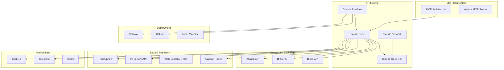

# Claude-Assisted Trading Stack

## Definition

The complete tooling ecosystem map for building and running Claude-powered autonomous trading systems. Enumerates every component, its role, and how components interconnect.

## Purpose

Canonical reference for which tools to use, how they connect, and what alternatives exist at each layer of the stack.

## Architecture Role

Infrastructure blueprint. Maps the technology choices to architectural roles defined in [[Architecture Overview]].

## Stack Diagram



## Component Registry

### AI Runtime

| Component | Role | Details |
|-----------|------|---------|
| [[Claude Code]] | Agent runtime, code execution | Primary development and execution environment |
| [[Claude Co-work]] | Agentic computer use | Computer control, file access, scheduled tasks |
| [[Claude Routines]] | Scheduled agent execution | Cron-based autonomous operation |
| Claude Opus 4.6 | Model | "Built for full throttle agentic work, judgment over ambiguity, self-verifying outputs" |

### Brokerage / Exchange

| Component | Role | Assets | Details |
|-----------|------|--------|---------|
| [[Alpaca API]] | US equities execution | Stocks, ETFs | Commission-free, paper + live trading |
| [[Exchange API Integration\|BitGet]] | Crypto execution | Crypto futures, spot | API key + secret + passphrase |
| [[Exchange API Integration\|Blofin]] | Crypto execution | Crypto futures | TRC20 USDT deposits |

### Data & Research

| Component | Role | Details |
|-----------|------|---------|
| [[TradingView Integration]] | Charting, signals, Pine Script | MCP connection, chart reading, indicator visualization |
| [[Perplexity API]] | Web research | Market news, catalyst research |
| Web Search/Fetch | General research | Native Claude Code capability |
| [[Capital Trades Integration]] | Politician/whale trade tracking | Congressional filing data via MCP, [[Copy Trading Strategy]] signals |

### Deployment

| Component | Role | Details |
|-----------|------|---------|
| [[Railway Deployment]] | Cloud hosting | 24/7 operation, cron scheduling |
| GitHub | Code + memory persistence | Remote routines clone/push repo |
| Local machine | Development, local routines | Desktop app, VS Code extension |

### Notifications

| Component | Role | Details |
|-----------|------|---------|
| ClickUp | Task management, notifications | API integration for end-of-day summaries |
| Telegram | Real-time alerts | Trade notifications, daily briefings |
| Slack | Team notifications | Channel-based alerts |

### MCP Layer

| Component | Role | Details |
|-----------|------|---------|
| [[MCP Architecture]] | Tool integration protocol | Standardized AI-tool connectors |
| Alpaca MCP Server | Natural language trading | "Trade with natural language" |

## Institutional Stack (Claude for Financial Services)

For institutional/enterprise use, Anthropic offers additional connectors:

| Provider | Data Type |
|----------|-----------|
| FactSet | Equity prices, fundamentals, consensus estimates |
| S&P Global | Capital IQ Financials, earnings transcripts |
| Morningstar | Valuation data, research analytics |
| PitchBook | Private capital market data |
| Daloopa | Fundamentals, KPIs from filings |
| Databricks | Unified analytics, big data |
| Snowflake | Enterprise data platform |
| Box | Document management, data rooms |
| Palantir | Large-scale data integration |

Source: [[SRC - Claude for Financial Services]]

## Configuration

### Environment Variables

```
ALPACA_API_KEY=...
ALPACA_SECRET_KEY=...
PERPLEXITY_API_KEY=...
CLICKUP_API_KEY=...
BITGET_API_KEY=...
BITGET_SECRET_KEY=...
BITGET_PASSPHRASE=...
```

See [[API Credential Isolation]], [[Environment Variable Management]].

## Dependencies

- [[Architecture Overview]] — system context
- [[Trading Engine Pipeline]] — execution flow
- [[API Credential Isolation]] — security model

## Failure Modes

- Missing or rotated API keys
- Service outage (exchange, data provider, deployment platform)
- Version incompatibility between components
- Rate limiting across multiple API providers

## Tradeoffs

| Decision | Tradeoff |
|----------|----------|
| Alpaca vs. exchange API | Equities simplicity vs. crypto 24/7 access |
| Railway vs. local | 24/7 uptime vs. cost and complexity |
| Perplexity vs. web fetch | Structured research vs. raw web access |
| Routines vs. Co-work | Scheduled autonomy vs. interactive control |

## Related Concepts

- [[Architecture Overview]]
- [[Claude Code]]
- [[Claude Routines]]
- [[Alpaca API]]
- [[TradingView Integration]]
- [[MCP Architecture]]

## Open Questions

- Optimal stack for crypto-only vs. equities-only?
- How to handle multi-exchange portfolio management?
- Cost optimization across routine invocations?

## Future Extensions

- Additional exchange integrations (Binance, Coinbase, Interactive Brokers)
- Institutional data provider MCP connectors
- Portfolio analytics dashboard
- Compliance reporting integrations
- Multi-model ensemble (different models for different tasks)

## Source References

- Source: [[SRC - Claude Opus Trader]] — primary stack definition (Alpaca, Perplexity, ClickUp, routines)
- Source: [[SRC - Claude TradingView Integration]] — TradingView-Exchange stack (BitGet, Railway)
- Source: [[SRC - Claude Cowork Trader]] — Co-work stack (Blofin, webhooks)
- Source: [[SRC - Claude Stock Trader]] — Alpaca + Claude Code stack
- Source: [[SRC - Claude for Financial Services]] — institutional data providers, MCP connectors
- Source: [[SRC - Claude Alpaca Trader]] — Capital Trades integration, copy trading data source
