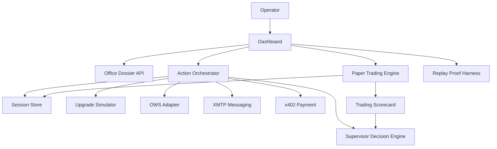
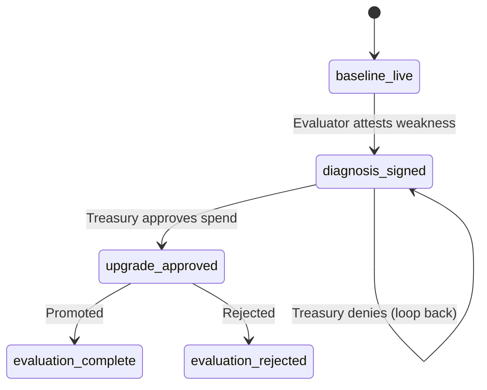

# Syndicate Squad Architecture

## Definition

A wallet-native supervisor system where an AI supervisor assembles agent teams, evaluates weaknesses, allocates treasury under policy constraints, applies upgrades, and records whether upgrades improved the office. The product is the supervisor, not the individual agents.

## Purpose

Demonstrates institutional AI autonomy: resource allocation, performance evaluation, learning from interventions, and policy-constrained decision-making. A model for how AI agent teams can self-improve.

## Architecture Role

Advanced multi-agent architecture. Extends the basic [[Multi-Agent Orchestration]] pattern with treasury management, deterministic evaluation, and replay-provable decision quality.

## System Diagram

## Core Components

| Component | Canonical Page | Role |
|-----------|---------------|------|
| [[Supervisor Decision Engine]] | `/agents/` | Score upgrades, allocate treasury |
| [[Office Action Loop]] | `/workflows/` | State machine for interventions |
| [[Treasury Policy System]] | `/governance/` | Budget constraints, spend limits |
| [[Paper Trading]] | `/strategies/` | Evidence generation for upgrades |
| Upgrade Simulator | — | Simulate metric improvements |
| Replay Proof Harness | — | Prove supervisor isn't scripted |
| Session Store | — | Persistent office state |

## Agent Desks

| Desk | Domain | Upgrade Target |
|------|--------|---------------|
| Research | Market scanning | Better data sources |
| Strategy | Signal generation | Improved algorithms |
| Execution | Order management | Lower latency |
| Evaluator | Performance scoring | Better metrics |
| Supervisor | Resource allocation | — (the supervisor IS the product) |

## Upgrade Lifecycle

## Promotion Logic

Deterministic criteria for upgrade promotion:
- At least 3 metrics improved
- No regressions
- Average relative improvement >= 12%

Source: [[SRC - OWS Dev Squad]]

## Integration Layer

| Integration | Protocol | Role |
|-------------|----------|------|
| OWS | Wallet/policy/signing | Authority layer, not decoration |
| XMTP | Messaging | Inter-desk communication |
| x402 | Micropayments | Pay-per-call upgrade purchases (USDC on Base Sepolia) |
| MoonPay | Fiat on/off-ramp | Treasury funding |

## What Is Real vs. Simulated

### Real
- Server-side office state, session persistence
- Supervisor decision engine with evidence-based scoring
- Upgrade simulator, multi-round evolution engine
- Deterministic replay corpus
- Paper trading with propose/verify/execute/close/score cycle
- OWS/XMTP readiness and health tracking

### Simulated
- Upgrade outcomes (deterministic deltas)
- Long-horizon office learning
- Market data (demo provider with seeded prices)

## Anti-Theater Layer

The replay proof harness proves:
- Multiple upgrade paths are used (not scripted)
- Failed upgrades can be rejected
- Supervisor recovers after failures
- Treasury can halt further spending
- Marginal-return stop conditions exist

Source: [[SRC - OWS Dev Squad]]

## Dependencies

- [[Supervisor Decision Engine]]
- [[Office Action Loop]]
- [[Treasury Policy System]]
- [[Paper Trading]]
- [[Multi-Agent Orchestration]]

## Related Concepts

- [[Architecture Overview]]
- [[Multi-Agent Orchestration]]
- [[Agent Memory Architecture]]
- [[Autonomous Trading Risk Model]]

## Source References

- Source: [[SRC - OWS Dev Squad]] — complete architecture specification
- Source: [[SRC - Build Spec]] — product requirements and demo flow
