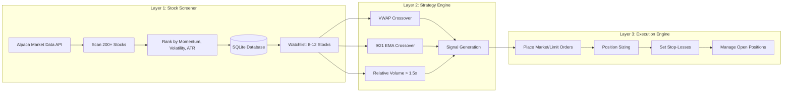

# Three-Layer Trading System

## Definition

A decomposition of the autonomous trading system into three functional layers: Stock Screener, Strategy Engine, and Execution Engine. This was the original architectural pattern from the first Claude Code + Alpaca implementation.

## Purpose

Provides clean separation of concerns: data acquisition, decision making, and order execution.

## Architecture Role

Implementation pattern within [[Trading Engine Pipeline]]. Maps to the research → strategy → execution stages.

## Layer Architecture

### Layer 1: Stock Screener
- Connects to [[Alpaca API]] market data
- Pulls daily and intraday candle data for top 200 stocks by volume in S&P 500
- Ranks by momentum, volatility, and Average True Range (ATR)
- Stores data in SQLite database
- Runs every morning before market open
- Outputs watchlist of 8-12 high-probability stocks

### Layer 2: Strategy Engine
- Applies indicator stack to watchlist candidates
- [[VWAP]] crossover for intraday trend direction
- [[EMA Crossover]] (9-period and 21-period) for momentum confirmation
- [[Relative Volume Filter]] (>1.5x average) for conviction filtering
- Claude designed this strategy autonomously from historical data analysis

### Layer 3: Execution Engine
- Connects directly to [[Alpaca API]] trading endpoints
- Places market and limit orders
- Calculates [[Position Sizing]] based on account equity and risk parameters
- Sets automatic [[Stop-Loss Systems|stop-losses]]
- Manages open positions in real time

## Performance Evidence

5-day paper trading results on $10,000 account:

| Day | Trades | Winners | Net P&L | Notable |
|-----|--------|---------|---------|---------|
| Monday | 7 | 5 | +$338 | NVDA momentum play, +2.1% in 40 min |
| Tuesday | 9 | 6 | +$412 | META breakout, held 90 min |
| Wednesday | 8 | 2 | -$271 | Sideways/choppy market |
| Thursday | - | - | +$487 | TSLA VWAP break, +3.4% single trade |
| Friday | - | - | +$221 | (derived) |
| **Total** | | | **+$1,187** | **11.8% return in 5 days** |

**Caveat**: Short sample period. Not statistically significant. See [[Overfitting Detection]].

Source: [[SRC - Claude Stock Trader]]

## Codebase

- ~15 files total
- Claude Code wrote every file through conversation
- Build time: ~4 hours across one afternoon
- No manual code writing required

## Dependencies

- [[Alpaca API]]
- [[VWAP]]
- [[EMA Crossover]]
- [[Relative Volume Filter]]
- [[Position Sizing]]
- [[Stop-Loss Systems]]

## Failure Modes

- Screener misranks instruments in regime change
- Strategy overfits to backtested period
- Execution engine hits API rate limits
- SQLite database corruption

## Tradeoffs

| Decision | Tradeoff |
|----------|----------|
| 200 stock universe | Broad coverage vs. slower scanning |
| SQLite storage | Simple vs. limited concurrent access |
| All-in-one codebase | Fast to build vs. hard to modularize |
| Claude-designed strategy | Novel combinations vs. unverified edge |

## Related Concepts

- [[Trading Engine Pipeline]]
- [[Architecture Overview]]
- [[Walk-Forward Optimization]]
- [[Backtesting Methodology]]

## Open Questions

- Does this architecture scale beyond S&P 500 universe?
- Optimal screener rerun frequency for intraday signals?
- How to incorporate fundamental data into Layer 1?

## Source References

- Source: [[SRC - Claude Stock Trader]] — complete architecture description, performance results
