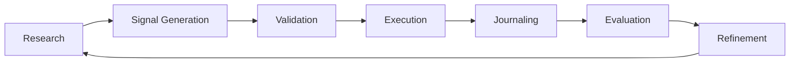
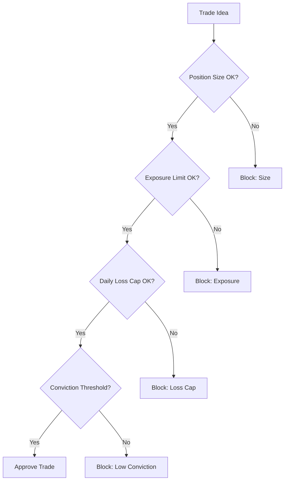

# Trading Engine Pipeline

## Definition

The end-to-end lifecycle of a trade from research through signal generation, validation, execution, journaling, evaluation, and refinement. This is the canonical execution flow for all autonomous trading architectures in the ecosystem.

## Purpose

Defines the sequential and feedback stages that transform market data and research into executed positions, then feed outcomes back into strategy refinement.

## Architecture Role

Central orchestration pipeline. All other subsystems (research, strategy, execution, memory, risk) plug into specific stages of this pipeline.

## Pipeline Stages



### Stage 1: Research

**Inputs**: Market data feeds, news, earnings, macro events
**Process**: Scan universe of instruments, identify catalysts, rank by momentum/volatility/ATR
**Outputs**: Watchlist of 8-12 high-probability candidates
**Tools**: [[Perplexity API]], [[TradingView Integration]], [[Alpaca API]] market data
**Timing**: Pre-market (6:00 AM)

The stock screening module connects to market data APIs, pulls daily and intraday candle data for top 200 stocks by volume, and ranks by momentum, volatility, and average true range. Data stored in SQLite database.

Source: [[SRC - Claude Stock Trader]]

### Stage 2: Signal Generation

**Inputs**: Watchlist, technical indicator values, strategy rules
**Process**: Apply indicator stack to each candidate, generate entry/exit signals
**Outputs**: Trade ideas with direction, entry price, targets, stops
**Indicator Stack**: [[VWAP]], [[EMA Crossover]], [[Relative Volume Filter]], RSI

Signal generation evaluates multiple conditions simultaneously. A trade idea fires only when ALL conditions align. See [[Signal Confirmation]].

### Stage 3: Validation

**Inputs**: Trade ideas, risk parameters, portfolio state
**Process**: Safety filter checks — position sizing, exposure limits, daily loss cap, conviction threshold
**Outputs**: Approved or blocked trade with reason



See [[Guardrail Architecture]], [[Position Sizing]], [[Autonomous Trading Risk Model]].

### Stage 4: Execution

**Inputs**: Approved trade, exchange connection, order parameters
**Process**: Place market/limit orders, set stop-losses, manage position lifecycle
**Outputs**: Open position with entry price, stop, target
**APIs**: [[Alpaca API]], [[Exchange API Integration]]

The execution engine places orders directly via brokerage API, calculates position size based on account equity and risk parameters, sets automatic stop-losses, and manages open positions in real time.

Source: [[SRC - Claude Stock Trader]]

### Stage 5: Journaling

**Inputs**: Executed trade data, market context, decision rationale
**Process**: Log trade details to journal, update memory files, notify operator
**Outputs**: Trade journal entry, updated memory state

Every trade is logged with: timestamp, instrument, direction, entry/exit prices, P&L, strategy signals, market conditions, and reasoning. See [[Trade Logging]], [[Agent Memory Architecture]].

### Stage 6: Evaluation

**Inputs**: Trade history, performance metrics, benchmark (S&P 500)
**Process**: Calculate win rate, risk-reward ratio, drawdown, benchmark comparison
**Outputs**: Performance scorecard, strategy grades

Weekly review evaluates: portfolio vs S&P 500, best/worst trades, strategy effectiveness. The agent self-grades (A-F) and identifies improvement areas.

Source: [[SRC - Claude Opus Trader]]

### Stage 7: Refinement

**Inputs**: Evaluation results, market regime changes, new research
**Process**: Update strategy parameters, adjust risk limits, modify indicator weights
**Outputs**: Updated strategy files, refined entry/exit rules

This closes the learning loop. Insights from evaluation feed back into research and signal generation. See [[Walk-Forward Optimization]].

## Variant: Syndicate Squad Paper Trading Pipeline

The [[Supervisor Decision Engine]] implements a variant:

```
scan → propose → verify → execute → close → score
```

Each step is gated by a `WorkCycleStage`. Scorecards feed back into the supervisor for upgrade decisions. See [[SRC - OWS Dev Squad]].

## Dependencies

- [[Agent Memory Architecture]] — persistent state between pipeline runs
- [[Context Budget Engineering]] — token management per pipeline stage
- [[Claude Routines]] — scheduling pipeline execution
- [[Guardrail Architecture]] — validation gates

## Failure Modes

- **Stale data**: Research based on delayed market data → wrong signals
- **Execution latency**: Delay between signal and order → slippage
- **Memory corruption**: Inconsistent file state between stages
- **Context overflow**: Pipeline reads too many files → token budget exceeded
- See [[LLM Failure Modes in Trading]] for comprehensive list

## Tradeoffs

| Decision | Tradeoff |
|----------|----------|
| Frequency of pipeline runs | More runs = more signals but higher cost |
| Research depth vs speed | Deep research consumes context budget |
| Autonomous vs supervised | Full autonomy risks runaway losses |
| Live vs paper execution | Paper trading validates but delays real returns |

## Operational Constraints

- Market hours: 9:30 AM - 4:00 PM ET (US equities)
- Crypto: 24/7 but with variable liquidity
- API rate limits per exchange
- Claude routine token budget: ~200K tokens per run

## Related Concepts

- [[Architecture Overview]]
- [[Three-Layer Trading System]]
- [[Claude-Assisted Trading Stack]]
- [[Autonomous Trading Risk Model]]

## Open Questions

- Optimal pipeline frequency for different asset classes?
- How to handle after-hours catalysts?
- Pipeline branching for multi-strategy execution?

## Future Extensions

- Multi-asset pipeline with asset-class-specific stages
- Reinforcement learning feedback in refinement stage
- Real-time streaming pipeline (vs. scheduled batch)
- Multi-agent pipeline with specialist agents per stage

## Source References

- Source: [[SRC - Claude Stock Trader]] — three-layer system, execution engine
- Source: [[SRC - Claude Opus Trader]] — routine-based scheduling, evaluation loop
- Source: [[SRC - Claude TradingView Integration]] — signal-to-execution pipeline
- Source: [[SRC - OWS Dev Squad]] — paper trading pipeline variant
