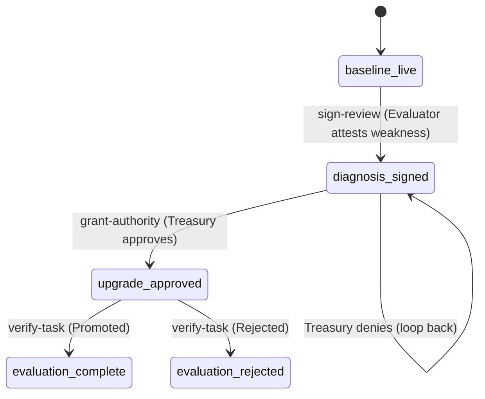

# Office Action Loop

## Definition

The state machine governing the [[Syndicate Squad Architecture]] intervention lifecycle. Progresses from baseline through diagnosis, upgrade approval, and evaluation.

## Purpose

Provides a deterministic, auditable flow for supervisor interventions. Each state transition maps to a specific action with OWS/XMTP/x402 integration points.

## Architecture Role

Workflow orchestration in [[Syndicate Squad Architecture]]. Each transition is executed by the Action Orchestrator.

## State Machine

## Actions

| Action | Trigger | Integration |
|--------|---------|-------------|
| sign-review | Evaluator attests weakness | OWS signing |
| grant-authority | Treasury approves/denies | OWS policy |
| verify-task | Evaluator promotes/rejects team version | OWS verification |

## Action Execution Flow

Each action function:
1. Reads current session and scenario
2. Checks integration readiness (OWS, XMTP, x402)
3. Attempts live calls with fallback to demo mode
4. Assembles result with nextStep, audit events, messages
5. Persists to session store

## Inputs

- Current office state (session)
- Integration readiness status
- Agent/request identifiers

## Outputs

- Next state
- Audit events
- XMTP messages
- OWS/x402 status

## Dependencies

- [[Supervisor Decision Engine]]
- [[Syndicate Squad Architecture]]
- [[Treasury Policy System]]

## Related Concepts

- [[Syndicate Squad Architecture]]
- [[Supervisor Decision Engine]]
- [[Treasury Policy System]]
- [[Multi-Agent Orchestration]]

## Source References

- Source: [[SRC - OWS Dev Squad]] — state machine specification, action orchestrator
- Source: [[SRC - Build Spec]] — demo flow (8-step sequence)
